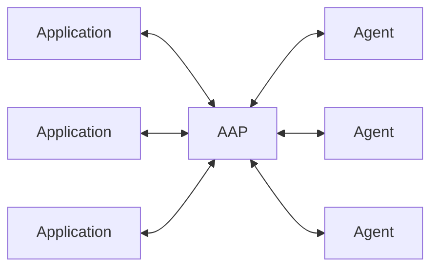
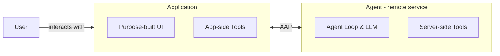

# Agent Application Protocol

A protocol for connecting any application to any agent.

Remote-first, agent as a service. Decouple the agent implementation from application business logic.

## Architecture

AAP is like MCP or USB — a standard connector between M applications and N agents. Any AAP-compatible application can plug into any AAP-compatible agent.

Users interact with the **Application**, not the agent directly. The application owns the UI/UX and provides domain-specific tools; the agent provides the intelligence.

Both sides can extend their capabilities via MCP servers — the application wires in domain tools, the agent wires in general-purpose tools like web search or code execution.

## Resources

- [Spec](./docs/protocol.md)
- [TypeScript SDK](https://github.com/agentapplicationprotocol/typescript-sdk)
- [Web playground](https://github.com/agentapplicationprotocol/playground)
- [Example agents](https://github.com/agentapplicationprotocol/agents)

## Why AAP

Today, agents are tightly coupled to the applications that host them. AAP separates the two:

- **Agent builders** can focus on building capable, general-purpose agents — remote, multi-tenant, usage-billed — without knowing anything about the application.
- **Application builders** can focus on domain knowledge and user experience, plugging in any compatible agent without managing agent loops and context window.

This separation enables a marketplace of interoperable agents and applications.

### vs ACP

[Agent Client Protocol (ACP)](https://agentclientprotocol.com) is primarily designed for IDEs connecting to local coding agents. AAP is built for a broader scope: connecting **any** application to **any** remote agent over the network, with multi-tenancy, auth, and streaming as first-class concerns.

| | AAP | ACP |
|---|---|---|
| Transport | HTTP + SSE (remote-first) | Local / in-process |
| Target | Any application ↔ any agent | IDE ↔ coding agent |
| Deployment | Agent as a remote service | Agent runs locally |

### Example Scenarios

All scenarios connect to the same general-purpose agent — the application provides domain-specific tools that give the agent context about its environment.

- **Professional creative tools** — 3D modeling software, game engines, video editors, CAD, or audio workstations expose their scene graph, asset library, or timeline as tools so the agent can manipulate geometry, generate levels, or orchestrate complex edits in natural language.
- **Enterprise platforms** — any internal app connects to a shared agent, with app-side tools scoped to the relevant domain (HR, legal, finance) without each team building their own agent loop.
- **Microservice ecosystems** — agents act as intelligent microservices, called by other services rather than users. Any service can delegate reasoning or decision-making to an agent over AAP, keeping the agent loop decoupled from the calling service.

## Credits

Inspired by [Agent Client Protocol (ACP)](https://agentclientprotocol.com), [Model Context Protocol (MCP)](https://modelcontextprotocol.io), and the Claude Agent SDK.
