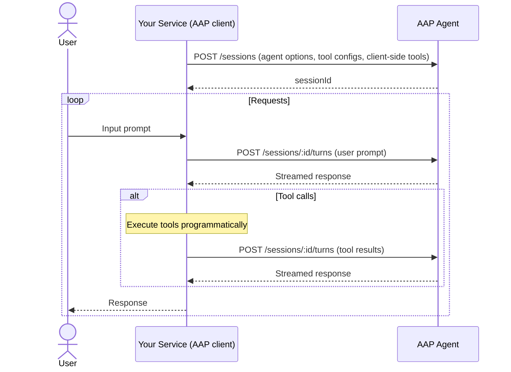

---
head:
  - - meta
    - name: description
      content: Use Agent Application Protocol (AAP) agents as internal microservices — delegate reasoning and decision-making to agents over HTTP from any backend service.
  - - meta
    - property: og:title
      content: Agent as a Microservice — Agent Application Protocol
  - - meta
    - property: og:description
      content: Use Agent Application Protocol (AAP) agents as internal microservices — delegate reasoning and decision-making to agents over HTTP from any backend service.
  - - meta
    - property: og:url
      content: https://agentapplicationprotocol.com/agent-as-a-microservice
  - - meta
    - name: twitter:title
      content: Agent as a Microservice — Agent Application Protocol
  - - meta
    - name: twitter:description
      content: Use Agent Application Protocol (AAP) agents as internal microservices — delegate reasoning and decision-making to agents over HTTP from any backend service.
---

# Agent as a Microservice

AAP agents can be used as internal services within your own system — not just in user-facing apps. Any backend service can act as an AAP client and delegate reasoning or decision-making to an agent over HTTP.

This lets your organization separate agent capabilities from business logic. Your agent team maintains general-purpose agents; your product teams consume them by name with a few config options, without knowing anything about the agent implementation.

## Responsibilities

| Responsibility        | Your service (AAP client) | AAP agent |
| --------------------- | ------------------------- | --------- |
| Business logic        | ✅                        |           |
| Domain-specific tools | ✅                        |           |
| Session management    | ✅                        |           |
| Agent loop & LLM      |                           | ✅        |
| General-purpose tools |                           | ✅        |
| Conversation history  |                           | ✅        |

## Architecture



There is no user in the loop — tool calls are handled programmatically and results submitted immediately, no permission prompts needed.

## Step 1: Configure your agent

Decide upfront:

- Which AAP agent to use and its options
- Which server-side tools to enable and trust
- Which client-side tools your service provides (domain-specific, e.g. querying your database or internal APIs)

## Step 2: Create a session

Create a session with your preconfigured agent options, server tool configs, and client-side tools:

```http
POST /sessions
Authorization: Bearer <api-key>
Content-Type: application/json

{
  "agent": {
    "name": "company-agent",
    "tools": [{ "name": "web_search", "trust": true }],
    "options": { "language": "English" }
  },
  "tools": [
    {
      "name": "get_policy_document",
      "description": "Retrieve an HR policy document by name.",
      "parameters": {
        "type": "object",
        "properties": {
          "name": { "type": "string", "description": "Policy document name" }
        },
        "required": ["name"]
      }
    }
  ]
}
```

## Step 3: Send turns

Send a user prompt to the session:

```http
POST /sessions/sess_abc123/turns
Authorization: Bearer <api-key>
Content-Type: application/json

{
  "stream": "delta",
  "messages": [{ "role": "user", "content": "What is the parental leave policy?" }]
}
```

## Step 4: Handle tool calls programmatically

After each response, the AAP SDK extracts any unresolved tool calls. Unlike user-facing apps, your service executes all tools immediately without prompting anyone:

1. For each `tool_call`, execute the tool in your service.
2. Gather all results into a single turn request and submit it.
3. Repeat until there are no unresolved tool calls.

For server-side tools, set `trust: true` so the agent runs them inline without stopping.

See [Tool Calls](/tool-call) for the full resolving flow.

## Step 5: Manage sessions

After a request is complete, decide whether to delete the session immediately or keep it for a period to allow follow-up turns. Delete it when it's no longer needed to free up resources on the agent server:

```http
DELETE /sessions/sess_abc123
Authorization: Bearer <api-key>
```

See [Endpoints](/endpoints) for full details.
