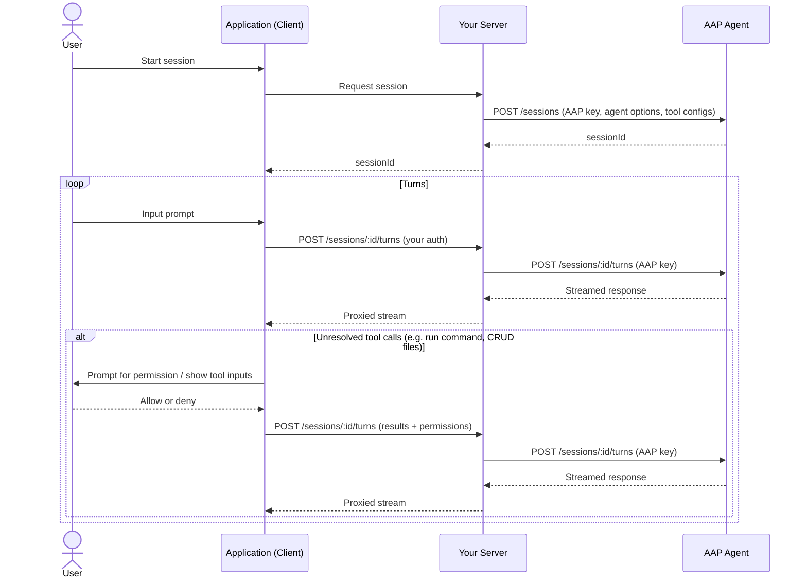

---
head:
  - - meta
    - name: description
      content: Tutorial — build a managed Agent Application Protocol (AAP) app where you control the agent. Your server proxies all requests for full control over filtering and routing.
  - - meta
    - property: og:title
      content: Build a Managed Agent App — Agent Application Protocol
  - - meta
    - property: og:description
      content: Tutorial — build a managed Agent Application Protocol (AAP) app where you control the agent. Your server proxies all requests for full control over filtering and routing.
  - - meta
    - property: og:url
      content: https://agentapplicationprotocol.com/build-a-managed-app
  - - meta
    - name: twitter:title
      content: Build a Managed Agent App — Agent Application Protocol
  - - meta
    - name: twitter:description
      content: Tutorial — build a managed Agent Application Protocol (AAP) app where you control the agent. Your server proxies all requests for full control over filtering and routing.
---

# Build a Managed Agent App

A managed agent app means your app controls which AAP agent to use — users don't configure the agent provider. You choose the agent, options, and tool configs; you pay for the AAP usage.

Your server sits between the client and the AAP agent for all requests. The client never communicates with the AAP agent directly, giving you full control over request and response filtering.

Client-side tools in a managed app often operate in the user's environment — reading or writing files, running shell commands, querying local data. Because these actions can be sensitive, your app should prompt the user for permission before executing them.

## What you need to implement

| Responsibility             | Your app (client) | Your server          | AAP agent |
| -------------------------- | ----------------- | -------------------- | --------- |
| UI & user input            | ✅                |                      |           |
| Client-side tools          | ✅                |                      |           |
| Session creation           | ✅ → via server   | ✅ proxies           |           |
| Turn requests              | ✅ → via server   | ✅ proxies + streams |           |
| Request/response filtering |                   | ✅                   |           |
| Agent loop & LLM           |                   |                      | ✅        |
| Server-side tools          |                   |                      | ✅        |
| Session history            |                   |                      | ✅        |

## Architecture



## Step 1: Configure your agent (build time)

Before shipping your app, decide:

- Which AAP agent provider and agent to use
- Agent options (e.g. model, language)
- Which server-side tools to enable and which to trust
- Which client-side tools your app provides

These are baked into your server — users never see or change them.

## Step 2: Authenticate the user

When the user opens your app, authenticate them against your own server using your existing auth mechanism (e.g. OAuth, session cookie, JWT).

## Step 3: Create a session via your server

The client asks your server to create a session. Your server calls `POST /sessions` on the AAP agent using your long-lived AAP API key, with your preconfigured agent options and tool configs. Your server returns only the `sessionId` to the client — the AAP key never leaves your server.

## Step 4: Send turns via your server

The client sends turns to your server (using your own auth), and your server proxies them to the AAP agent and streams the response back:

```
Client → POST /your-server/sessions/:id/turns
       → Your server → POST /aap-agent/sessions/:id/turns
                     ← Streamed response
       ← Proxied stream
```

Your server can inspect or filter requests and responses at this layer.

## Step 5: Handle tool calls

After each response, the AAP SDK extracts any unresolved tool calls — client-side tools to execute and untrusted server-side tools awaiting permission.

**If there are unresolved tool calls**, prompt the user for each one:

- Show the tool name and description.
- Use the tool's input schema to display each parameter name, value, and description.
- Ask the user to allow or deny (or update trust via `agent.tools` overrides).

Gather all results and permissions into a single turn request and submit it via your server proxy.

**If there are no unresolved tool calls**, ask the user for their next message and go back to Step 4.

See [Tool Calls](/tool-call) for the full resolving flow.

## Step 6: Manage sessions

Use the session endpoints proxied through your server to let users list, view, and delete their sessions. Your server forwards requests to the AAP agent using your API key. See [Endpoints](/endpoints) for full request and response details.
