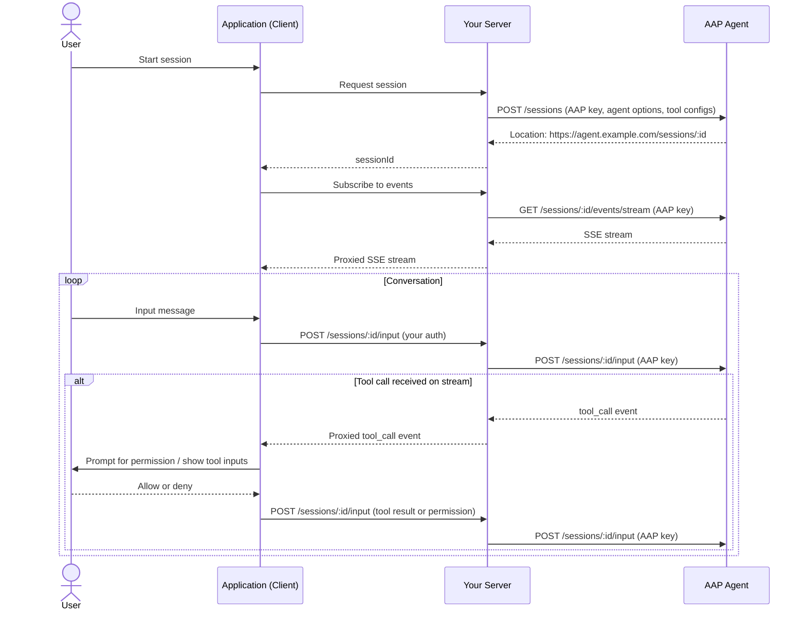

---
head:
  - - meta
    - name: description
      content: Tutorial — build a managed Agent Application Protocol (AAP) app where you control the agent. Your server proxies all requests for full control over filtering and routing.
  - - meta
    - property: og:title
      content: Build a Managed Agent App — Agent Application Protocol
  - - meta
    - property: og:description
      content: Tutorial — build a managed Agent Application Protocol (AAP) app where you control the agent. Your server proxies all requests for full control over filtering and routing.
  - - meta
    - property: og:url
      content: https://agentapplicationprotocol.com/build-a-managed-app
  - - meta
    - name: twitter:title
      content: Build a Managed Agent App — Agent Application Protocol
  - - meta
    - name: twitter:description
      content: Tutorial — build a managed Agent Application Protocol (AAP) app where you control the agent. Your server proxies all requests for full control over filtering and routing.
---

# Build a Managed Agent App

A managed agent app means your app controls which AAP agent to use — users don't configure the agent provider. You choose the agent, options, and tool configs; you pay for the AAP usage.

Your server sits between the client and the AAP agent for all requests. The client never communicates with the AAP agent directly, giving you full control over request and response filtering.

Client-side tools in a managed app often operate in the user's environment — reading or writing files, running shell commands, querying local data. Because these actions can be sensitive, your app should prompt the user for permission before executing them.

## What you need to implement

| Responsibility             | Your app (client) | Your server          | AAP agent |
| -------------------------- | ----------------- | -------------------- | --------- |
| UI & user input            | ✅                |                      |           |
| Client-side tools          | ✅                |                      |           |
| Session creation           | ✅ → via server   | ✅ proxies           |           |
| Event stream subscription  | ✅ → via server   | ✅ proxies + streams |           |
| Input publishing           | ✅ → via server   | ✅ proxies           |           |
| Request/response filtering |                   | ✅                   |           |
| Agent loop & LLM           |                   |                      | ✅        |
| Server-side tools          |                   |                      | ✅        |
| Session history            |                   |                      | ✅        |

## Architecture


```mermaid
sequenceDiagram
    actor User
    participant App as Application (Client)
    participant Server as Your Server
    participant Agent as AAP Agent

    User->>App: Start session
    App->>Server: Request session
    Server->>Agent: POST /sessions (AAP key, agent options, tool configs)
    Agent-->>Server: Location: https://agent.example.com/sessions/:id
    Server-->>App: sessionId

    App->>Server: Subscribe to events
    Server->>Agent: GET /sessions/:id/events/stream (AAP key)
    Agent-->>Server: SSE stream
    Server-->>App: Proxied SSE stream

    loop Conversation
        User->>App: Input message
        App->>Server: POST /sessions/:id/input (your auth)
        Server->>Agent: POST /sessions/:id/input (AAP key)

        alt Tool call received on stream
            Agent-->>Server: tool_call event
            Server-->>App: Proxied tool_call event
            App->>User: Prompt for permission / show tool inputs
            User-->>App: Allow or deny
            App->>Server: POST /sessions/:id/input (tool result or permission)
            Server->>Agent: POST /sessions/:id/input (AAP key)
        end
    end
```

## Step 1: Configure your agent (build time)

Before shipping your app, decide:

- Which AAP agent provider and agent to use
- Agent options (e.g. model, language)
- Which server-side tools to enable and which to trust
- Which client-side tools your app provides

These are baked into your server — users never see or change them.

## Step 2: Authenticate the user

When the user opens your app, authenticate them against your own server using your existing auth mechanism (e.g. OAuth, session cookie, JWT).

## Step 3: Create a session via your server

The client asks your server to create a session. Your server calls [`POST /sessions`](/endpoints#post-sessions) on the AAP agent using your long-lived AAP API key, with your preconfigured agent options and tool configs. The AAP agent returns the session URL as an absolute URL in the `Location` header — for example `https://agent.example.com/sessions/sess_abc123`. Your server extracts the session ID and returns only that ID to the client. The AAP key never leaves your server.

## Step 4: Subscribe to the event stream and proxy input via your server

Once the session is created, your server opens a long-lived proxy to the AAP agent's event stream and pipes it to the client:

```
Client → GET /your-server/sessions/:id/events/stream
       → Your server → GET /aap-agent/sessions/:id/events/stream (AAP key)
                     ← SSE stream
       ← Proxied SSE stream
```

User messages and tool results are submitted as short HTTP requests through your server:

```
Client → POST /your-server/sessions/:id/input
       → Your server → POST /aap-agent/sessions/:id/input (AAP key)
```

Your server can inspect or filter both the event stream and input requests at this layer.

## Step 5: Handle tool calls

When the client receives a `tool_call` event on the stream, check whether the tool is a client-side tool or an untrusted server-side tool.

**For client-side tools**, prompt the user for each one:

- Show the tool name and description.
- Use the tool's input schema to display each parameter name, value, and description.
- Ask the user to allow or deny.

Execute allowed tools and submit each result individually via your server proxy:

```json
{
  "type": "tool",
  "toolCallId": "call_001",
  "content": "Tokyo: 18°C, partly cloudy"
}
```

Submit denied tools as a permission rejection:

```json
{
  "type": "permission",
  "toolCallId": "call_002",
  "granted": false,
  "reason": "User denied file system access."
}
```

Each result or permission is submitted as a separate `POST /sessions/:id/input` request — do not batch them. To auto-allow a server-side tool in future turns, update the session's server-side tool settings with [`PATCH /sessions/:id`](/endpoints#patch-sessions-id).

See [Tool Calls](/tool-call) for the full resolving flow.

## Step 6: Manage sessions

Use the session endpoints proxied through your server to let users list, view, and delete their sessions. Your server forwards requests to the AAP agent using your API key. See [Endpoints](/endpoints) for full request and response details.
