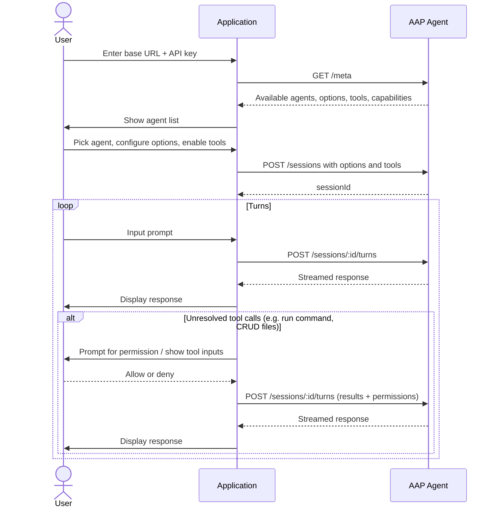

# Build an Open Agent App

An open agent app lets users bring their own AAP agent — they configure the server URL and API key, and your app connects to whatever agent they choose. No provider lock-in, no backend required.

This is the same model as the [AAP web playground](https://agentapplicationprotocol.github.io/playground/).

Client-side tools in an open app often operate directly in the user's environment — reading or writing files, running shell commands, querying local data. Because these actions can be sensitive, your app should prompt the user for permission before executing them.

## What you need to implement

| Responsibility    | Your app | AAP agent |
| ----------------- | -------- | --------- |
| UI & user input   | ✅       |           |
| Client-side tools | ✅       |           |
| Agent loop & LLM  |          | ✅        |
| Server-side tools |          | ✅        |
| Session history   |          | ✅        |

Your app only needs an AAP client — no backend, no agent loop, no LLM integration.

## Architecture



## Step 1: Collect connection settings

Show a settings form with two fields:

- **AAP Base URL** — e.g. `https://api.example.com/v1`
- **API Key** — passed as `Authorization: Bearer <key>` on every request

## Step 2: Fetch available agents

Call `GET /meta` to discover what agents the server offers:

```http
GET /meta
Authorization: Bearer <api-key>
```

The response includes each agent's name, description, configurable options, tools, and capabilities. See [Endpoints](/endpoints#get-meta) for the full response schema.

Use `capabilities` to filter agents to those that support what your app needs (e.g. streaming, image input, client-side tools).

## Step 3: Let the user pick an agent and configure options

Render the agent list and, once the user selects one, show a form with two sections:

**Options** — each option has a `type` (`text`, `select`, or `secret`) and a `default`.

**Server-side tools** — the agent's `tools` array lists tools it exposes for client configuration. Each tool has a `name`, `description`, and `parameters` (input schema). For each tool, let the user:

- **Enable/disable** it — only enabled tools are passed in `agent.tools` when creating the session.
- **Trust** it — if trusted (`trust: true`), the agent invokes the tool inline without stopping to ask for permission. If not trusted, your app will receive a `tool_call` event at runtime and must prompt the user to grant or deny permission — the tool's `description` and `parameters` are what you show in that prompt.

## Step 4: Create a session

When the user is ready to start, create a session with the chosen agent, its options, server tool configs, and any client-side tools your app provides:

```http
POST /sessions
Authorization: Bearer <api-key>
Content-Type: application/json

{
  "agent": {
    "name": "research-agent",
    "tools": [{ "name": "web_search", "trust": true }],
    "options": { "language": "English" }
  },
  "tools": [
    {
      "name": "get_current_document",
      "description": "Returns the content of the document currently open in the editor.",
      "parameters": { "type": "object", "properties": {} }
    }
  ]
}
```

Response:

```json
{ "sessionId": "sess_abc123" }
```

Store the `sessionId` — you'll use it for every turn.

Client-side tools declared here are persisted for the session.

## Step 5: Send turns and handle responses

Send each user message to the session. You can override agent options, server tool configs, and client-side tools per turn — the agent cannot be changed after session creation:

```http
POST /sessions/sess_abc123/turns
Authorization: Bearer <api-key>
Content-Type: application/json

{
  "stream": "delta",
  "messages": [{ "role": "user", "content": "Summarize the latest AI news." }],
  "agent": {
    "tools": [{ "name": "web_search", "trust": false }],
    "options": { "language": "Japanese" }
  },
  "tools": [
    {
      "name": "get_current_document",
      "description": "Returns the content of the document currently open in the editor.",
      "parameters": { "type": "object", "properties": {} }
    }
  ]
}
```

Stream the response back to the user. See [Response Modes](/response) for how to handle `delta`, `message`, and `none` stream types.

## Step 6: Handle the next turn

After receiving a response, the AAP SDK parses it and extracts any unresolved tool calls — client-side tools your app must execute, and untrusted server-side tools awaiting permission.

**If there are unresolved tool calls**, prompt the user for each one:

- Show the tool name and description.
- Use the tool's input schema to display each parameter name, its value, and description so the user understands what will run.
- Ask the user to allow or deny (or update trust via `agent.tools` overrides to auto-allow in future turns).

Once the user responds to all prompts, gather every tool result and permission into a single turn request and submit it. The server persists any `agent` or `tools` overrides you include for the rest of the session.

**If there are no unresolved tool calls**, the turn is complete — ask the user for their next message and go back to Step 5.

See [Tool Calls](/tool-call) for the full resolving flow.

## Step 7: Manage sessions

Let users view and manage their past sessions using the session endpoints.

**List sessions** — paginate through all sessions on the server:

```http
GET /sessions
GET /sessions?after=<cursor>
Authorization: Bearer <api-key>
```

Returns a `sessions` array and an optional `next` cursor for the next page.

**Get a session** — retrieve a specific session and its configuration:

```http
GET /sessions/sess_abc123
Authorization: Bearer <api-key>
```

**Delete a session** — remove a session and its history:

```http
DELETE /sessions/sess_abc123
Authorization: Bearer <api-key>
```

Returns `204 No Content` on success.

**Get session history** — retrieve the conversation history for a session (only available if the agent declared history capabilities in `GET /meta`):

```http
GET /sessions/sess_abc123/history?type=compacted
Authorization: Bearer <api-key>
```

`type` is either `compacted` or `full`, depending on what the agent supports via `capabilities.history`.

See [Endpoints](/endpoints) for full request and response details.
