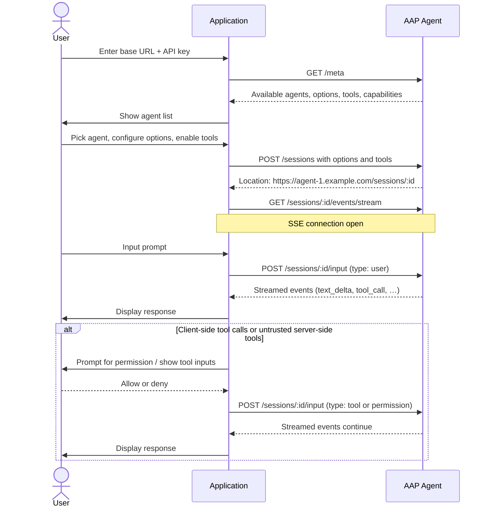

---
head:
  - - meta
    - name: description
      content: Tutorial — build an open Agent Application Protocol (AAP) app where users bring their own agent. No backend required, no provider lock-in.
  - - meta
    - property: og:title
      content: Build an Open Agent App — Agent Application Protocol
  - - meta
    - property: og:description
      content: Tutorial — build an open Agent Application Protocol (AAP) app where users bring their own agent. No backend required, no provider lock-in.
  - - meta
    - property: og:url
      content: https://agentapplicationprotocol.com/build-an-open-app
  - - meta
    - name: twitter:title
      content: Build an Open Agent App — Agent Application Protocol
  - - meta
    - name: twitter:description
      content: Tutorial — build an open Agent Application Protocol (AAP) app where users bring their own agent. No backend required, no provider lock-in.
---

# Build an Open Agent App

An open agent app lets users bring their own AAP agent — they configure the server URL and API key, and your app connects to whatever agent they choose. No provider lock-in, no backend required.

This is the same model as the [AAP web playground](https://agentapplicationprotocol.github.io/playground/).

Client-side tools in an open app often operate directly in the user's environment — reading or writing files, running shell commands, querying local data. Because these actions can be sensitive, your app should prompt the user for permission before executing them.

## What you need to implement

| Responsibility    | Your app | AAP agent |
| ----------------- | -------- | --------- |
| UI & user input   | ✅       |           |
| Client-side tools | ✅       |           |
| Agent loop & LLM  |          | ✅        |
| Server-side tools |          | ✅        |
| Session history   |          | ✅        |

Your app only needs an AAP client — no backend, no agent loop, no LLM integration.

## Architecture


```mermaid
sequenceDiagram
    actor User
    participant App as Application
    participant Agent as AAP Agent

    User->>App: Enter base URL + API key
    App->>Agent: GET /meta
    Agent-->>App: Available agents, options, tools, capabilities
    App->>User: Show agent list
    User->>App: Pick agent, configure options, enable tools
    App->>Agent: POST /sessions with options and tools
    Agent-->>App: Location: https://agent-1.example.com/sessions/:id
    App->>Agent: GET /sessions/:id/events/stream
    Note over App,Agent: SSE connection open
    User->>App: Input prompt
    App->>Agent: POST /sessions/:id/input (type: user)
    Agent-->>App: Streamed events (text_delta, tool_call, …)
    App->>User: Display response
    alt Client-side tool calls or untrusted server-side tools
        App->>User: Prompt for permission / show tool inputs
        User-->>App: Allow or deny
        App->>Agent: POST /sessions/:id/input (type: tool or permission)
        Agent-->>App: Streamed events continue
        App->>User: Display response
    end
```

## Step 1: Collect connection settings

Show a settings form with two fields:

- **AAP Base URL** — e.g. `https://api.example.com/v1`
- **API Key** — passed as `Authorization: Bearer <key>` on every request

## Step 2: Fetch available agents

Call [`GET /meta`](/endpoints#get-meta) to discover what agents the server offers:

```http
GET /meta
Authorization: Bearer <api-key>
```

The response includes each agent's name, description, configurable options, tools, and capabilities. See [Endpoints](/endpoints#get-meta) for the full response schema.

Use `capabilities` to filter agents to those that support what your app needs (e.g. streaming, image input, client-side tools).

## Step 3: Let the user pick an agent and configure options

Render the agent list and, once the user selects one, show a form with two sections:

**Options** — each option has a `type` (`text`, `select`, or `secret`) and a `default`.

**Server-side tools** — the agent's `tools` array lists tools it exposes for client configuration. Each tool has a `name`, `description`, and `parameters` (input schema). For each tool, let the user:

- **Enable/disable** it — only enabled tools are passed in `agent.tools` when creating the session.
- **Trust** it — if trusted (`trust: true`), the agent invokes the tool inline without stopping to ask for permission. If not trusted, your app will receive a `tool_call` event at runtime and must prompt the user to grant or deny permission — the tool's `description` and `parameters` are what you show in that prompt.

## Step 4: Create a session

When the user is ready to start, create a session with the chosen agent, its options, server tool configs, and any client-side tools your app provides:

```http
POST /sessions
Authorization: Bearer <api-key>
Content-Type: application/json

{
  "agent": {
    "name": "research-agent",
    "tools": [{ "name": "web_search", "trust": true }],
    "options": { "language": "English" }
  },
  "tools": [
    {
      "name": "get_current_document",
      "description": "Returns the content of the document currently open in the editor.",
      "parameters": { "type": "object", "properties": {} }
    }
  ]
}
```

Response:

```http
HTTP/1.1 201 Created
Location: https://agent-1.example.com/sessions/sess_abc123
```

The `Location` header contains the absolute URL of the created session. Extract and store it — you must use this URL as the base for all subsequent requests on this session, including `/input`, `/events/stream`, and `/history`. In a distributed deployment, the session may be hosted on a different origin than where you sent the `POST /sessions` request.

Client-side tools declared here are persisted for the session.

## Step 5: Subscribe to the event stream and send messages

Before sending user input, subscribe to the session event stream:

```http
GET /sessions/sess_abc123/events/stream?stream=delta
Authorization: Bearer <api-key>
```

This opens a persistent SSE connection. The server will replay any events not yet persisted into history, then stream new events as they occur. Keep this connection open for the lifetime of the session — it delivers all agent output including text, tool calls, and state changes.

Once subscribed, send the user's message to the session inbox:

```http
POST /sessions/sess_abc123/input
Authorization: Bearer <api-key>
Content-Type: application/json

{
  "type": "user",
  "content": "Summarize the latest AI news."
}
```

The server enqueues the input, emits an `input` event to all subscribers, and delivers it to the active session worker. Agent output arrives over the SSE stream you already have open.

To change agent options, server tool configs, or client-side tools, update the session with [`PATCH /sessions/:id`](/endpoints#patch-sessions-id).

## Step 6: Handle tool calls

While the agent is running, it may emit `tool_call` events over the SSE stream for client-side tools your app must execute, or for untrusted server-side tools that require user permission.

For each `tool_call` event:

- Show the tool name and description.
- Use the tool's input schema to display each parameter name, its value, and description so the user understands what will run.
- Ask the user to allow or deny.

Submit each result or permission individually as it is resolved — do not wait to batch them:

```http
POST /sessions/sess_abc123/input
Authorization: Bearer <api-key>
Content-Type: application/json

{
  "type": "tool",
  "toolCallId": "call_001",
  "content": "Tokyo: 18°C, partly cloudy"
}
```

For a permission decision:

```http
POST /sessions/sess_abc123/input
Authorization: Bearer <api-key>
Content-Type: application/json

{
  "type": "permission",
  "toolCallId": "call_002",
  "granted": false,
  "reason": "User denied file system access."
}
```

The agent receives each result as it arrives and continues processing. To auto-allow a server-side tool in future turns, update the session's tool settings with [`PATCH /sessions/:id`](/endpoints#patch-sessions-id).

See [Tool Calls](/tool-call) for the full resolving flow.

## Step 7: Manage sessions

Let users view and manage their past sessions using the session endpoints.

**List sessions** — paginate through all sessions on the server:

```http
GET /sessions
GET /sessions?after=<cursor>
Authorization: Bearer <api-key>
```

Returns a `sessions` array and an optional `next` cursor for the next page.

**Get a session** — retrieve a specific session and its configuration:

```http
GET /sessions/sess_abc123
Authorization: Bearer <api-key>
```

**Delete a session** — remove a session and its history:

```http
DELETE /sessions/sess_abc123
Authorization: Bearer <api-key>
```

Returns `204 No Content` on success.

**Get session history** — retrieve the conversation history for a session (only available if the agent declared history capabilities in [`GET /meta`](/endpoints#get-meta)):

```http
GET /sessions/sess_abc123/history
Authorization: Bearer <api-key>
```

See [Endpoints](/endpoints) for full request and response details.
