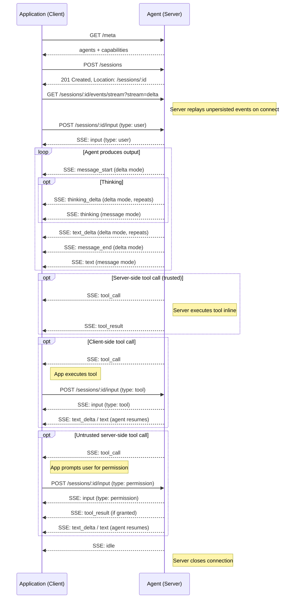

---
head:
  - - meta
    - name: description
      content: Agent Application Protocol (AAP) response format for turn requests — streaming SSE deltas, batch responses, tool calls, and stop reasons.
  - - meta
    - property: og:title
      content: Response — Agent Application Protocol
  - - meta
    - property: og:description
      content: Agent Application Protocol (AAP) response format for turn requests — streaming SSE deltas, batch responses, tool calls, and stop reasons.
  - - meta
    - property: og:url
      content: https://agentapplicationprotocol.com/event
  - - meta
    - name: twitter:title
      content: Response — Agent Application Protocol
  - - meta
    - name: twitter:description
      content: Agent Application Protocol (AAP) response format for turn requests — streaming SSE deltas, batch responses, tool calls, and stop reasons.
---

# Event Stream

All agent output is delivered through the session event stream. Subscribe by connecting to:

```
GET /sessions/:id/events/stream
```

### Query Parameters

- `stream` — _(required)_ streaming mode. Must be one of the modes declared in `GET /meta` capabilities.
  - `delta` — stream text as incremental `text_delta` and `thinking_delta` events.
  - `message` — stream complete `text` and `thinking` events per message.

If `stream` is omitted or the requested mode is not supported by the agent, the server returns `400 Bad Request`.

The server returns `Content-Type: text/event-stream`. Multiple subscribers can connect to the same session simultaneously.

On connect, the server replays all events that have not yet been persisted into history so the client can restore live session state without needing a cursor. After replay, new live events are streamed as they occur.

## Event Types

Each SSE event has an `event` field and a `data` field containing a JSON payload. All events carry an `id` (stable identifier) and a `timestamp` (server time, ISO 8601).

### `input`

Emitted when the server accepts and enqueues a client input. Broadcast to all subscribers so every subscriber sees the full input history regardless of who submitted it.

```
event: input
data: {"id":"evt_001","timestamp":"2026-07-12T13:00:00Z","type":"user","content":"What's the weather in Tokyo?"}

event: input
data: {"id":"evt_002","timestamp":"2026-07-12T13:00:01Z","type":"tool","toolCallId":"call_001","content":"Tokyo: 18°C, partly cloudy"}

event: input
data: {"id":"evt_003","timestamp":"2026-07-12T13:00:02Z","type":"permission","toolCallId":"call_002","granted":false,"reason":"User denied."}

event: input
data: {"id":"evt_004","timestamp":"2026-07-12T13:00:03Z","type":"cancel"}
```

### `message_start`

_(delta mode only)_ Emitted at the start of a new agent message. Carries the message `id` so clients can associate all subsequent deltas with this message.

```
event: message_start
data: {"id":"msg_abc123"}
```

### `text_delta`

_(delta mode only)_ Incremental text from the agent.

```
event: text_delta
data: {"delta":"I'll prioritize the pricing analysis first."}
```

### `thinking_delta`

_(delta mode only)_ Incremental thinking/reasoning from the agent.

```
event: thinking_delta
data: {"delta":"The user wants to reprioritize. I should acknowledge and adjust."}
```

### `message_end`

_(delta mode only)_ Emitted when the agent message is complete. Carries the message `id` for correlation and the server-side `timestamp` of when the message was finished.

```
event: message_end
data: {"id":"msg_abc123","timestamp":"2026-07-12T13:00:05Z"}
```

### `text`

_(message mode only)_ Complete text of a single agent message.

```
event: text
data: {"id":"msg_abc123","timestamp":"2026-07-12T13:00:05Z","text":"I'll prioritize the pricing analysis first."}
```

### `thinking`

_(message mode only)_ Complete thinking/reasoning of a single agent message.

```
event: thinking
data: {"id":"msg_abc124","timestamp":"2026-07-12T13:00:04Z","thinking":"The user wants to reprioritize. I should acknowledge and adjust."}
```

### `tool_call`

Emitted when the agent requests a tool invocation.

```
event: tool_call
data: {"id":"evt_005","timestamp":"2026-07-12T13:00:06Z","toolCallId":"call_001","name":"get_weather","input":{"location":"Tokyo"}}
```

For **client-side tools**, the client executes the tool and submits the result via [`POST /sessions/:id/input`](/endpoints#post-sessions-id-input) with `type: "tool"`.

For **server-side tools** where `trust: true`, the server invokes the tool inline and emits a `tool_result` event — no client action is needed.

For **server-side tools** where `trust: false`, the client submits a `type: "permission"` input to grant or deny execution.

### `tool_result`

Emitted when a server-side tool result is available.

```
event: tool_result
data: {"id":"evt_006","timestamp":"2026-07-12T13:00:07Z","toolCallId":"call_001","content":"Tokyo: 18°C, partly cloudy"}
```

### `error`

Emitted for session-level runtime errors. Keep the SSE connection open after receiving an error event — the server will close the connection when appropriate.

```
event: error
data: {"id":"evt_007","timestamp":"2026-07-12T13:00:08Z","code":"agent_error","message":"Agent failed while processing input."}
```

### `idle`

Emitted when the session has been idle for a period. The server closes the connection after this event. The client may reconnect at any time.

```
event: idle
data: {"id":"evt_008","timestamp":"2026-07-12T13:00:09Z"}
```

## Sequence Diagram


