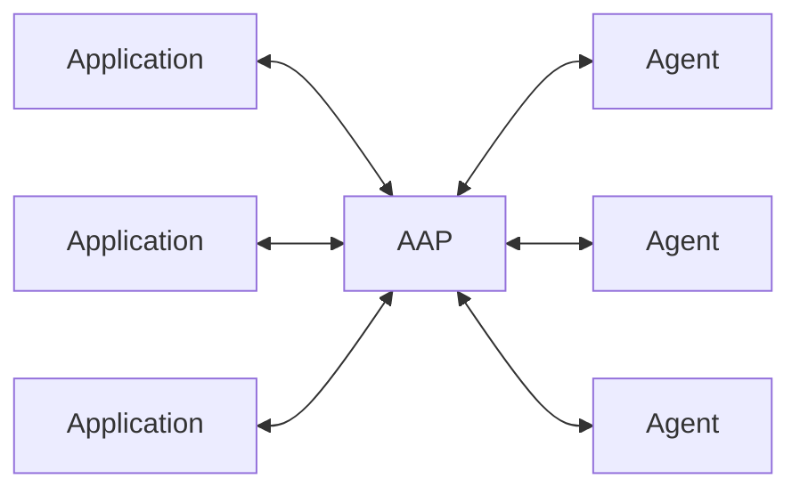
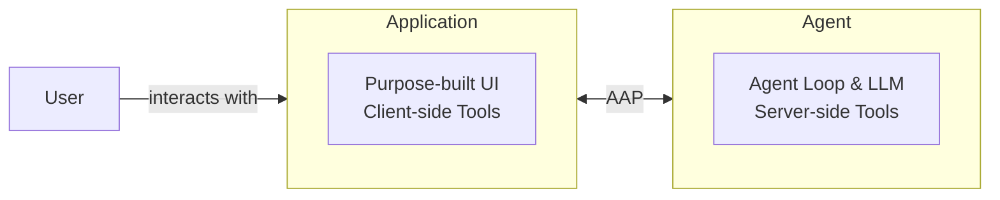

---
head:
  - - meta
    - name: description
      content: Overview of the Agent Application Protocol (AAP) — architecture, core concepts, and how applications and agents communicate over HTTP.
  - - meta
    - property: og:title
      content: Overview — Agent Application Protocol
  - - meta
    - property: og:description
      content: Overview of the Agent Application Protocol (AAP) — architecture, core concepts, and how applications and agents communicate over HTTP.
  - - meta
    - property: og:url
      content: https://agentapplicationprotocol.com/overview
  - - meta
    - name: twitter:title
      content: Overview — Agent Application Protocol
  - - meta
    - name: twitter:description
      content: Overview of the Agent Application Protocol (AAP) — architecture, core concepts, and how applications and agents communicate over HTTP.
---

# Agent Application Protocol (∀/A)

A protocol for connecting any application to any agent.

Remote-first, agent as a service. Decouple the agent implementation from application business logic.

## Architecture

The Agent Application Protocol (AAP) defines how Applications and Agents communicate over HTTP.

- **Application** acts as the client: owns the UI, accepts user input, provides application specific tools.
- **Agent** acts as the server: runs the agent loop, manages conversation history, provides general tools, handles LLM interaction, and enforces guardrails and safety policies.

AAP is like MCP or USB — a standard connector between M applications and N agents. Any AAP-compatible application can plug into any AAP-compatible agent.

Users interact with the **Application**, not the agent directly. The application owns the UI/UX and provides domain-specific tools; the agent provides the intelligence.

There are two kinds of tools:

- **Client-side tools**: owned and executed by the Application. Declared in the request with full schema. When the LLM requests, the agent emits `tool_call` events and stops; the application executes them and re-submits with the results.
- **Server-side tools**: owned and executed by the Agent (e.g. persistent memory management, web search, code execution). Declared by the server in `GET /meta`. The application references them by name only in requests. If `trust: true`, the server invokes the tool inline and streams the result back without stopping.

Both sides can extend their capabilities via MCP servers — the application wires in domain tools, the agent wires in general-purpose tools like web search or code execution.

Communication uses HTTP with Server-Sent Events (SSE) for streaming responses. This makes servers stateless and horizontally scalable — session history can be stored externally with no persistent server connection required.

## Why AAP

Today, agents are tightly coupled to the applications that host them. AAP separates the two — much like microservices decoupled backend components:

- **Agent builders** can focus on building capable, general-purpose agents — remote, multi-tenant, usage-billed — without knowing anything about the application. They can use any agent framework and language they prefer (e.g. Vercel AI SDK, LangChain, Strands Agents).
- **Application builders** can focus on domain knowledge and user experience, plugging in any compatible agent without managing agent loops and context windows. They can build in their native environment and language (e.g. Godot/GDScript, Blender/Python, professional content creation software).
- **Both sides** retain full privacy over their own implementation details — agents keep their internal logic, memory, and model routing confidential; applications keep their business logic and user data private.

This separation enables a marketplace of interoperable agents and applications.

## Example Scenarios

All scenarios could connect to the same general-purpose agent — the application provides domain-specific tools that give the agent context about its environment.

- **Professional creative tools** — 3D modeling software, game engines, video editors, CAD, or audio workstations expose their scene graph, asset library, or timeline as tools so the agent can manipulate geometry, generate levels, or orchestrate complex edits in natural language.
- **Enterprise platforms** — any internal app connects to a shared agent, with app-side tools scoped to the relevant domain (HR, legal, finance) without each team building their own agent loop.
- **Microservice ecosystems** — agents act as intelligent microservices, called by other services rather than users. Any service can delegate reasoning or decision-making to an agent over AAP, keeping the agent loop decoupled from the calling service.

## vs. ACP

[Agent Client Protocol (ACP)](https://agentclientprotocol.com) is primarily designed for IDEs connecting to local coding agents. AAP targets any application connecting to any remote agent.

|            | AAP                                    | ACP                                     |
| ---------- | -------------------------------------- | --------------------------------------- |
| Target     | Any application ↔ any agent            | IDE ↔ coding agent                      |
| Transport  | HTTP + SSE, no bidirectional channel   | JSON-RPC, requires a long-lived session |
| Tools      | Application tools + agent tools        | Agent tools only                        |
| Deployment | Remote-first, SaaS, agent as a service | Local-first                             |

> [ACP's streamable HTTP transport](https://agentclientprotocol.com/protocol/transports#streamable-http) is still a draft proposal.
>
> [ACP's application-provided tools](https://agentclientprotocol.com/rfds/mcp-over-acp) is also still in draft.

## Credits

Inspired by [Agent Client Protocol (ACP)](https://agentclientprotocol.com), [Model Context Protocol (MCP)](https://modelcontextprotocol.io), and the Claude Agent SDK.
