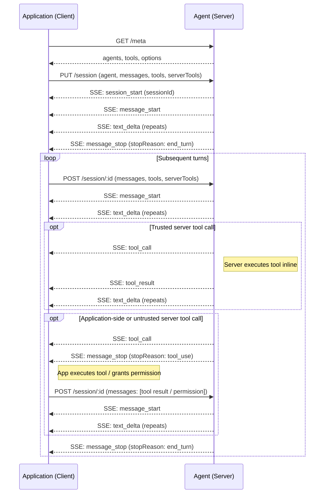

# Agent Application Protocol — Protocol Specification

## Overview

The Agent Application Protocol (AAP) defines how Applications and Agents communicate over HTTP.

- **Application** acts as the client: owns the UI, accepts user input, provides specific tools.
- **Agent** acts as the server: runs the agent loop, manages conversation history, provides general tools, handles LLM interaction.

There are two kinds of tools:

- **Application-side tools**: owned and executed by the Application. Declared in the request with full schema. When the LLM requests one, the agent emits a `tool_call` event and stops; the client executes it and re-submits with the result.
- **Server-side tools**: owned and executed by the Agent (e.g. web search, code execution). Declared by the server in `GET /meta`. The client references them by name only in requests. If `trust: true`, the server invokes the tool inline and streams the result back without stopping.

Communication uses HTTP with Server-Sent Events (SSE) for streaming responses, modeled after streaming LLM APIs.

---

## Authentication

All endpoints accept an API key via the `Authorization` header:

```
Authorization: Bearer <api-key>
```

Auth is optional on `GET /meta` — servers may choose to expose it publicly for capability discovery.

---

## Endpoints

| Method | Path | Description |
|--------|------|-------------|
| `GET` | `/meta` | Get available agents and their tools |
| `PUT` | `/session` | Create a new session |
| `POST` | `/session/:id` | Send a new turn to an existing session |
| `GET` | `/session/:id` | Get a session by ID |
| `GET` | `/sessions` | List sessions |
| `DELETE` | `/session/:id` | Delete a session |

---

## GET /meta

Returns the protocol version and the list of agents available on this server.

### Response

```json
{
  "version": 1,
  "agents": [
    {
      "name": "research-agent",
      "title": "Research Agent",
      "version": "1.2.0",
      "description": "A research agent that can search the web and summarize information.",
      "tools": [
        {
          "name": "web_search",
          "title": "Web Search",
          "description": "Search the web for information",
          "inputSchema": {
            "type": "object",
            "properties": {
              "query": { "type": "string", "description": "Search query" }
            },
            "required": ["query"]
          }
        }
      ],
      "options": [
        {
          "name": "model",
          "title": "Model",
          "description": "The LLM model to use for this agent.",
          "type": "select",
          "options": ["claude-sonnet-4-5", "claude-opus-4-5"],
          "default": "claude-sonnet-4-5"
        },
        {
          "name": "language",
          "title": "Response Language",
          "description": "The language the agent should respond in.",
          "type": "text",
          "default": "English"
        }
      ],
      "capabilities": {
        "history": {
          "compacted": true,
          "full": false
        }
      }
    }
  ]
}
```

**Agent fields:**

- `name` — unique identifier for the agent on this server.
- `title` — *(optional)* human-readable display name.
- `version` — semantic version of the agent.
- `description` — human-readable description of what the agent does.
- `tools` — server-side tools this agent can invoke. The client references them by name in requests.
- `options` — configurable options the client may set per request.
- `capabilities` — declares what the agent supports:
  - `history.compacted` — if `true`, the server persists a compacted history and will return it in `GET /session/:id`.
  - `history.full` — if `true`, the server persists the full uncompacted history and will return it in `GET /session/:id`.

**Option fields:**

- `name` — identifier used as the key in the request `options` object.
- `title` — *(optional)* human-readable display name.
- `description` — explains what this option does.
- `type` — `"text"` for free-form string input, `"select"` for a fixed list of choices.
- `options` — *(required for `select`)* list of allowed values.
- `default` — default value used if the client omits this option.

---

## PUT /session

Creates a new session. The server returns a `sessionId` the client uses for subsequent turns.

### Request Body

```json
{
  "agent": "research-agent",
  "stream": "chunk",
  "messages": [
    { "role": "user", "content": "What's the capital of France?" },
    { "role": "assistant", "content": "The capital of France is Paris." },
    { "role": "user", "content": "What's the weather in Tokyo?" }
  ],
  "tools": [
    {
      "name": "get_weather",
      "description": "Get current weather for a location",
      "inputSchema": {
        "type": "object",
        "properties": {
          "location": { "type": "string" }
        },
        "required": ["location"]
      }
    }
  ],
  "serverTools": [
    { "name": "web_search", "trust": true }
  ],
  "options": {
    "model": "claude-opus-4-5",
    "language": "Japanese"
  }
}
```

**Fields:**

- `agent` — *(required)* agent name to invoke.
- `stream` — *(optional)* response mode: `"chunk"`, `"message"`, or `"none"` (default). See [Response Modes](#response-modes).
- `messages` — *(required)* conversation history to seed the session with. The last message must be a `user` message, which becomes the first turn.
- `tools` — *(optional)* application-side tools with full schema.
- `serverTools` — *(optional)* server-side tools to enable.
- `options` — *(optional)* key-value pairs matching the agent's declared `options`.

**`serverTools` object fields:**

- `name` — server tool name as declared in `/meta`.
- `trust` — if `true`, the server may invoke this tool without requesting client permission.

### Response

Returns the `sessionId` followed by the agent's response stream (or JSON body).

For non-streaming mode:

```json
{
  "sessionId": "sess_abc123",
  "stopReason": "end_turn",
  "messages": [
    { "role": "assistant", "content": "The weather in Tokyo is 18°C, partly cloudy." }
  ]
}
```

For SSE modes, `sessionId` is returned in the `session_start` event at the beginning of the stream. See [SSE Events](#sse-events-stream-chunk-and-stream-message).

---

## POST /session/:id

Send a new user turn or tool calling results to an existing session. The server appends the message to its history, runs the agent, and streams or returns the response.

### Request Body

```json
{
  "stream": "chunk",
  "messages": [
    { "role": "user", "content": "What about Osaka?" }
  ],
  "tools": [
    {
      "name": "get_weather",
      "description": "Get current weather for a location",
      "inputSchema": {
        "type": "object",
        "properties": {
          "location": { "type": "string" }
        },
        "required": ["location"]
      }
    }
  ],
  "serverTools": [
    { "name": "web_search", "trust": true }
  ],
  "options": {
    "language": "English"
  }
}
```

**Fields:**

- `stream` — *(optional)* response mode. See [Response Modes](#response-modes).
- `messages` — *(required)* the new turn(s) to append. Typically a single `user` message, but may also be tool results or tool permissions when re-submitting after a `tool_use` stop.
- `tools` — *(optional)* application-side tools. Overrides tools declared at session creation for this session.
- `serverTools` — *(optional)* server-side tools. Overrides server tools declared at session creation for this session.
- `options` — *(optional)* key-value pairs matching the agent's declared `options`. Overrides options declared at session creation for this session.

---

## GET /session/:id

Returns the full session object for the given session ID.

### Response

```json
{
  "sessionId": "sess_abc123",
  "agent": "research-agent",
  "tools": [
    {
      "name": "get_weather",
      "description": "Get current weather for a location",
      "inputSchema": {
        "type": "object",
        "properties": {
          "location": { "type": "string" }
        },
        "required": ["location"]
      }
    }
  ],
  "serverTools": [
    { "name": "web_search", "trust": true }
  ],
  "options": {
    "model": "claude-opus-4-5",
    "language": "Japanese"
  },
  "history": {
    "compacted": [...],
    "full": [...]
  }
}
```

**Fields:**

- `sessionId` — the session identifier.
- `agent` — the agent name this session is running.
- `tools` — application-side tools declared for this session.
- `serverTools` — server-side tools declared for this session.
- `options` — options declared for this session.
- `history` — *(optional)* conversation history. If the agent declared `capabilities.history.compacted: true` or `capabilities.history.full: true` in `GET /meta`, the server **must** return the corresponding field(s). Otherwise the server may omit them.
  - `compacted` — the server's compacted conversation history.
  - `full` — the full uncompacted conversation history.

---

## GET /sessions

Returns a paginated list of session IDs.

### Query Parameters

- `limit` — *(optional)* maximum number of sessions to return. Server may enforce a maximum.
- `after` — *(optional)* cursor for pagination. Pass the last `sessionId` from the previous page to get the next page.

### Response

```json
{
  "sessions": ["sess_abc123", "sess_def456"],
  "nextCursor": "sess_def456"
}
```

**Fields:**

- `sessions` — array of session IDs.
- `nextCursor` — *(optional)* pass as `after` to retrieve the next page. Absent when there are no more results.

---

## DELETE /session/:id

Deletes a session and its associated history.

### Response

`204 No Content`

---

## Response Modes

### `stream: "chunk"`

`Content-Type: text/event-stream`. The server streams SSE events as they are produced. Text is sent as incremental `text_delta` chunks; thinking is sent as incremental `thinking_delta` chunks.

### `stream: "message"`

`Content-Type: text/event-stream`. The server streams SSE events, but text is sent as a single complete `text`/`thinking` event per message rather than incremental chunks. Tool call events still arrive as they happen.

### `stream: "none"` (default)

`Content-Type: application/json`. The server returns a single JSON response after the agent finishes. If the agent needs a client-side tool result, it returns a `tool_use` stop reason in the JSON body and the client re-submits with results — same flow as SSE, just without streaming.

---

## SSE Events (`stream: "chunk"` and `stream: "message"`)

Each event is a JSON object on the `data:` field.

#### `session_start`

Emitted at the very beginning of the stream for `PUT /session`. Contains the `sessionId` the client must store for subsequent turns.

```
event: session_start
data: {"sessionId": "sess_abc123"}
```

#### `message_start`

Emitted at the beginning of each agent response.

```
event: message_start
data: {}
```

#### `text_delta`

*(chunk mode only)* An incremental chunk of the agent's text response.

```
event: text_delta
data: {"delta": "The weather in Tokyo is..."}
```

#### `thinking_delta`

*(chunk mode only)* An incremental chunk of the agent's thinking/reasoning.

```
event: thinking_delta
data: {"delta": "The user is asking about Tokyo weather, I should..."}
```

#### `text`

*(message mode only)* The complete agent text response.

```
event: text
data: {"text": "The weather in Tokyo is 18°C, partly cloudy."}
```

#### `thinking`

*(message mode only)* The complete agent thinking/reasoning.

```
event: thinking
data: {"thinking": "The user is asking about Tokyo weather, I should use the weather tool..."}
```

#### `tool_call`

The agent wants to invoke a tool. Multiple `tool_call` events may be emitted before `message_stop` — the client should collect all of them and handle in parallel.

For **application-side tools**, the client executes the tool and re-submits with results.

For **server-side tools** where `trust: true`, the server invokes the tool inline and emits a `tool_result` event with the result — no client round-trip needed. The agent continues streaming without stopping.

For **server-side tools** where `trust: false`, the server stops and the client responds with a permission decision. The agent continues regardless — if denied, the LLM is informed the tool was not permitted.

The agent only emits `message_stop` with `stopReason: "tool_use"` if there is at least one application-side tool call or one untrusted server-side tool call that requires client action. If all tool calls are trusted server-side tools, the agent handles them inline and continues without stopping.

```
event: tool_call
data: {"toolCallId": "call_001", "name": "get_weather", "input": {"location": "Tokyo"}}
```

Tool names must be unique across `tools` and `serverTools` in a single request. The client identifies whether a tool call is application-side or server-side by matching the name against its request.

#### `tool_result`

*(server-side trusted tools only)* Emitted after the server executes a trusted tool inline. The agent continues streaming after this event.

```
event: tool_result
data: {"toolCallId": "call_001", "content": "Tokyo: 18°C, partly cloudy"}
```

#### `message_stop`

Emitted at the end of the stream.

```
event: message_stop
data: {"stopReason": "end_turn"}
```

**Stop reasons:**

| `stopReason` | Meaning |
|---|---|
| `end_turn` | Agent finished normally |
| `tool_use` | Agent emitted one or more `tool_call` events requiring client action (application-side tool or untrusted server-side tool) |
| `max_tokens` | Hit token limit |
| `refusal` | LLM refused to respond (e.g. safety policy) |
| `error` | Server encountered an error mid-stream |
| `cancelled` | Client closed the connection |

---

## JSON Response (`stream: "none"`)

Normal response:

```json
{
  "stopReason": "end_turn",
  "messages": [
    { "role": "assistant", "content": "The weather in Tokyo is 18°C, partly cloudy." }
  ]
}
```

`PUT /session` additionally includes `sessionId`:

```json
{
  "sessionId": "sess_abc123",
  "stopReason": "end_turn",
  "messages": [
    { "role": "assistant", "content": "The weather in Tokyo is 18°C, partly cloudy." }
  ]
}
```

With thinking:

```json
{
  "stopReason": "end_turn",
  "messages": [
    {
      "role": "assistant",
      "content": [
        { "type": "thinking", "thinking": "The user wants Tokyo weather. I should use the get_weather tool." },
        { "type": "text", "text": "The weather in Tokyo is 18°C, partly cloudy." }
      ]
    }
  ]
}
```

When an application-side tool is needed, or an untrusted server-side tool requires permission:

```json
{
  "stopReason": "tool_use",
  "messages": [
    {
      "role": "assistant",
      "content": [
        { "type": "tool_use", "toolCallId": "call_001", "name": "get_weather", "input": { "location": "Tokyo" } }
      ]
    }
  ]
}
```

The client re-submits via `POST /session/:id` with the tool result or permission:

```json
{
  "messages": [
    { "role": "tool", "toolCallId": "call_001", "content": "Tokyo: 18°C, partly cloudy" }
  ]
}
```

When a trusted server-side tool was called inline, the full exchange is included in the returned messages:

```json
{
  "stopReason": "end_turn",
  "messages": [
    {
      "role": "assistant",
      "content": [
        { "type": "tool_use", "toolCallId": "call_002", "name": "web_search", "input": { "query": "Tokyo weather today" } }
      ]
    },
    {
      "role": "tool",
      "toolCallId": "call_002",
      "content": "Tokyo: 18°C, partly cloudy"
    },
    {
      "role": "assistant",
      "content": "The weather in Tokyo is 18°C, partly cloudy."
    }
  ]
}
```

---

## Message Format

Messages follow OpenAI-compatible roles.

### System message

```json
{ "role": "system", "content": "You are a helpful assistant that responds concisely." }
```

### User message

```json
{ "role": "user", "content": "What's the weather in Tokyo?" }
```

`content` may be a string or an array of content blocks.

### Assistant message

```json
{
  "role": "assistant",
  "content": [
    { "type": "thinking", "thinking": "The user wants the weather in Tokyo. I should use the get_weather tool." },
    { "type": "text", "text": "Let me check that for you." },
    { "type": "tool_use", "toolCallId": "call_001", "name": "get_weather", "input": { "location": "Tokyo" } }
  ]
}
```

### Tool result message

```json
{ "role": "tool", "toolCallId": "call_001", "content": "Tokyo: 18°C, partly cloudy" }
```

`content` may be a string or an array of content blocks.

### Tool permission message

Used to respond to a server-side `tool_call`. The agent continues and informs the LLM of the decision.

Once the permission request has been processed, it must be removed from history — they are transient and not part of the persistent conversation history.

When `granted: false`, the client may include an optional `reason` string that the agent will relay to the LLM.

```json
{ "role": "tool_permission", "toolCallId": "call_002", "granted": true }
```

```json
{ "role": "tool_permission", "toolCallId": "call_002", "granted": false, "reason": "User declined" }
```

---

## Tool Call Flow

### Application-side tool

```
1. Client  →  PUT /session or POST /session/:id
2. Server  →  SSE: tool_call  (toolCallId, name, input)
3. Server  →  SSE: message_stop  (stopReason: "tool_use")
4. Client executes tool
5. Client  →  POST /session/:id  (messages: [tool result])
6. Server  →  SSE: text_delta, message_stop  (stopReason: "end_turn")
```

### Server-side tool (trusted, inline)

```
1. Client  →  PUT /session or POST /session/:id
2. Server  →  SSE: tool_call  (toolCallId, name, input)
3. Server executes tool inline
4. Server  →  SSE: tool_result  (toolCallId, content)
5. Server  →  SSE: text_delta, message_stop  (stopReason: "end_turn")
```

### Server-side tool (permission required)

```
1. Client  →  PUT /session or POST /session/:id
2. Server  →  SSE: tool_call  (toolCallId, name, input)
3. Server  →  SSE: message_stop  (stopReason: "tool_use")
4. Client grants or denies permission
5. Client  →  POST /session/:id  (messages: [tool_permission])
6. Server executes tool (or informs LLM of denial), continues streaming
7. Server  →  SSE: text_delta, message_stop  (stopReason: "end_turn")
```

### Parallel tool calls

The server may emit multiple `tool_call` events before `message_stop`. The client should handle all of them — execute application-side tools and respond to untrusted server tool permissions — then re-submit all results and permissions together in a single `POST /session/:id`. Trusted server-side tools are handled inline by the server and do not require client action.

---

## History Management

The server owns the conversation history for each session. The client never re-sends prior messages — it only sends new turns via `POST /session/:id`.

The server must persist at minimum a **compacted history**: a representation of the conversation sufficient for the LLM to continue coherently. The compaction strategy is agent-specific — the server may summarize, truncate, or drop content (e.g. old tool results) as it sees fit. The client is never notified of compaction.

The server may additionally persist the **full uncompacted history** for use cases such as audit trails, history replay, or user-facing conversation display. This is optional and implementation-defined.

Each agent declares its history persistence capabilities in `GET /meta` via `capabilities.history`:

- `compacted: true` — the server persists compacted history and will return it in `GET /session/:id`.
- `full: true` — the server persists full history and will return it in `GET /session/:id`.

If `full: false`, the client may choose to maintain its own full history by recording all messages it sends and receives.

---

## Sequence Diagram



---

## Schema

```typescript
// GET /session/:id response
interface SessionResponse {
  sessionId: string;
  agent: string;
  tools: ToolSpec[];
  serverTools: ServerToolRef[];
  options: Record<string, string>;
  history?: {
    compacted?: Message[];  // omitted if server chooses not to expose
    full?: Message[];       // omitted if server does not persist full history
  };
}

// GET /sessions response
interface SessionListResponse {
  sessions: string[];       // array of sessionIds
  nextCursor?: string;      // absent when no more results
}

// GET /meta response
interface MetaResponse {
  version: number;
  agents: AgentInfo[];
}

interface AgentInfo {
  name: string;
  title?: string;
  version: string;                      // semantic version
  description: string;
  tools: ToolSpec[];
  options: AgentOption[];
  capabilities: {
    history: {
      compacted: boolean;               // server persists and exposes compacted history
      full: boolean;                    // server persists and exposes full history
    };
  };
}

type AgentOption =
  | { name: string; title?: string; description: string; type: "text"; default: string }
  | { name: string; title?: string; description: string; type: "select"; options: string[]; default: string };

// PUT /session request
interface CreateSessionRequest {
  agent: string;
  stream?: "chunk" | "message" | "none"; // default: "none"
  messages: Message[];                   // seed history; last message must be a user message
  tools?: ToolSpec[];
  serverTools?: ServerToolRef[];
  options?: Record<string, string>;
}

// POST /session/:id request
interface SessionTurnRequest {
  stream?: "chunk" | "message" | "none"; // default: "none"
  messages: Message[];                   // new turn(s); typically a single user message
  tools?: ToolSpec[];                    // overrides session tools for this turn
  serverTools?: ServerToolRef[];         // overrides session serverTools for this turn
  options?: Record<string, string>;      // per-turn option overrides
}

interface ServerToolRef {
  name: string;
  trust: boolean;
}

// Tool spec (application-side, declared in request; server-side, declared in /meta)
interface ToolSpec {
  name: string;
  title?: string;
  description: string;
  inputSchema: JsonSchema;
}

// Messages
type Message =
  | { role: "system"; content: string }
  | { role: "user"; content: string | ContentBlock[] }
  | { role: "assistant"; content: string | ContentBlock[] }
  | { role: "tool"; toolCallId: string; content: string | ContentBlock[] }
  | { role: "tool_permission"; toolCallId: string; granted: boolean; reason?: string };

type ContentBlock =
  | { type: "text"; text: string }
  | { type: "thinking"; thinking: string }
  | { type: "tool_use"; toolCallId: string; name: string; input: Record<string, unknown> }
  | { type: "image"; mimeType: string; data: string };

// SSE event data (stream: "chunk" and stream: "message")
type SSEEvent =
  | { event: "session_start"; sessionId: string }    // PUT /session only
  | { event: "message_start" }
  | { event: "text_delta"; delta: string }           // chunk mode only
  | { event: "thinking_delta"; delta: string }       // chunk mode only
  | { event: "text"; text: string }                  // message mode only
  | { event: "thinking"; thinking: string }          // message mode only
  | { event: "tool_call"; toolCallId: string; name: string; input: Record<string, unknown> }
  | { event: "tool_result"; toolCallId: string; content: string | ContentBlock[] } // trusted server tools only
  | { event: "message_stop"; stopReason: StopReason };

// JSON response body (stream: "none")
interface AgentResponse {
  sessionId?: string;   // present in PUT /session response only
  stopReason: StopReason;
  messages: Message[];
}

type StopReason = "end_turn" | "tool_use" | "max_tokens" | "refusal" | "error" | "cancelled";
```

---

## Extensibility

- Add custom fields via `_meta` on any object.
