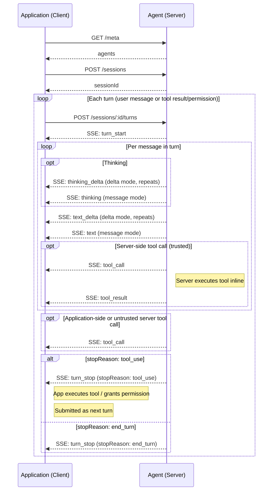

---
head:
  - - meta
    - name: description
      content: Agent Application Protocol (AAP) response format for turn requests — streaming SSE deltas, batch responses, tool calls, and stop reasons.
  - - meta
    - property: og:title
      content: Response — Agent Application Protocol
  - - meta
    - property: og:description
      content: Agent Application Protocol (AAP) response format for turn requests — streaming SSE deltas, batch responses, tool calls, and stop reasons.
  - - meta
    - property: og:url
      content: https://agentapplicationprotocol.com/response
  - - meta
    - name: twitter:title
      content: Response — Agent Application Protocol
  - - meta
    - name: twitter:description
      content: Agent Application Protocol (AAP) response format for turn requests — streaming SSE deltas, batch responses, tool calls, and stop reasons.
---

# Response

This page describes the response format for the turn request [`POST /sessions/{id}/turns`](./endpoints.md).

## Response Modes

### `stream: "delta"`

`Content-Type: text/event-stream`. The server streams SSE events as they are produced. Text is sent as incremental `text_delta` events; thinking is sent as incremental `thinking_delta` events. The agent typically invokes the LLM with streaming enabled to produce deltas in real time.

### `stream: "message"`

`Content-Type: text/event-stream`. The server streams SSE events, but text is delivered as a complete `text`/`thinking` event per message rather than incremental deltas. A single turn may produce multiple messages, each emitted as its own event. Tool call events still arrive as they happen. The agent may invoke the LLM with streaming disabled and emit each full message once complete.

### `stream: "none"` (default)

`Content-Type: application/json`. The server returns a single JSON response after the agent finishes.

## SSE Events (`stream: "delta"` and `stream: "message"`)

Each event is a JSON object on the `data:` field.

### `turn_start`

Marks the beginning of the agent's response. This is the first event in every `POST /sessions/:id/turns` stream.

```
event: turn_start
data: {}
```

### `text_delta`

_(delta mode only)_ An incremental delta of the agent's text response. Only emitted between `turn_start` and `turn_stop`.

```
event: text_delta
data: {"delta": "The weather in Tokyo is..."}
```

### `thinking_delta`

_(delta mode only)_ An incremental delta of the agent's thinking/reasoning. Only emitted between `turn_start` and `turn_stop`.

```
event: thinking_delta
data: {"delta": "The user is asking about Tokyo weather, I should..."}
```

### `text`

_(message mode only)_ The complete text of a single agent message. A turn may produce multiple messages, each emitted as a separate `text` event. Only emitted between `turn_start` and `turn_stop`.

```
event: text
data: {"text": "The weather in Tokyo is 18°C, partly cloudy."}
```

### `thinking`

_(message mode only)_ The complete thinking/reasoning of a single agent message. A turn may produce multiple messages, each emitted as a separate `thinking` event. Only emitted between `turn_start` and `turn_stop`.

```
event: thinking
data: {"thinking": "The user is asking about Tokyo weather, I should use the weather tool."}
```

### `tool_call`

Only emitted between `turn_start` and `turn_stop`. The agent wants to invoke a tool. Multiple `tool_call` events may be emitted before `turn_stop` — the client should collect all of them and handle in parallel.

```
event: tool_call
data: {"toolCallId": "call_001", "name": "get_weather", "input": {"location": "Tokyo"}}
```

For **client-side tools**, the client executes the tool and submits the results in a subsequent `POST /sessions/:id/turns` request.

For **server-side tools** where `trust: true`, the server invokes the tool inline and emits a `tool_result` event with the result — no client round-trip needed. The agent continues streaming without stopping.

For **server-side tools** where `trust: false`, the server stops and the client submits a permission decision for each untrusted tool call in a subsequent `POST /sessions/:id/turns` request. The agent continues regardless — if denied, the LLM is informed the tool was not permitted.

The agent only emits `turn_stop` with `stopReason: "tool_use"` if there is at least one client-side tool call or one untrusted server-side tool call that requires client action. If all tool calls are trusted server-side tools, the agent handles them inline and continues without stopping.

The client must collect all client-side tool results and untrusted server-side tool permissions and submit them together in a single subsequent `POST /sessions/:id/turns` request.

Tool names must be unique across application tools and agent tools in a single request. The client identifies whether a tool call is application-side or server-side by matching the name against its request.

### `tool_result`

_(server-side tools only)_ Only emitted between `turn_start` and `turn_stop`. Emitted after the server executes a server-side tool — either inline for trusted tools, or after the client grants permission for untrusted tools. The agent continues streaming after this event.

```
event: tool_result
data: {"toolCallId": "call_001", "content": "Tokyo: 18°C, partly cloudy"}
```

### `turn_stop`

Always the final event in the stream. Marks the end of the agent's response.

```
event: turn_stop
data: {"stopReason": "end_turn"}
```

**Stop reasons:**

| `stopReason` | Meaning                                                                                                                                                                                    |
| ------------ | ------------------------------------------------------------------------------------------------------------------------------------------------------------------------------------------ |
| `end_turn`   | Agent finished normally                                                                                                                                                                    |
| `tool_use`   | Agent emitted one or more `tool_call` events requiring client action (client-side tool or untrusted server-side tool)                                                                      |
| `max_tokens` | Hit token limit — agents should implement their own history compaction strategy to avoid this; if no compaction is in place and the context window overflows, this stop reason is returned |
| `refusal`    | LLM refused to respond (e.g. safety policy)                                                                                                                                                |
| `error`      | Server encountered an error mid-stream                                                                                                                                                     |

### Sequence Diagram



## JSON Response (`stream: "none"`)

```typescript
/** JSON response body for non-streaming (`stream: "none"`) requests. */
interface AgentResponse {
  stopReason: StopReason;
  messages: HistoryMessage[];
}
```

### System message

```json
{
  "role": "system",
  "content": "You are a helpful assistant that responds concisely."
}
```

### User message

```json
{ "role": "user", "content": "What's the weather in Tokyo?" }
```

`content` may be a string or an array of content blocks.

### Assistant message

```json
{
  "role": "assistant",
  "content": [
    {
      "type": "thinking",
      "thinking": "The user wants the weather in Tokyo. I should use the get_weather tool."
    },
    { "type": "text", "text": "Let me check that for you." },
    {
      "type": "tool_use",
      "toolCallId": "call_001",
      "name": "get_weather",
      "input": { "location": "Tokyo" }
    }
  ]
}
```

### Tool result message

- **Server-side tool**: the agent executes the tool, stores the result in history, and includes it in the returned messages.
- **client-side tool**: the client executes the tool and submits the result via `POST /sessions/:id/turns`.

```json
{
  "role": "tool",
  "toolCallId": "call_001",
  "content": "Tokyo: 18°C, partly cloudy"
}
```

`content` may be a string or an array of content blocks.

### Tool permission message

Used to submit a permission decision for an untrusted server-side tool call via `POST /sessions/:id/turns`. The agent continues and informs the LLM of the decision. These messages are never stored in session history.

When `granted: true`, the agent executes the tool and stores the tool result in history. When `granted: false`, the agent stores a `tool` message in history with a denial description (e.g. `"Tool call denied"`, or `"Tool call denied: <reason>"` if a `reason` was provided) to inform the LLM. The client may include an optional `reason` string that the agent will relay to the LLM.

```json
{ "role": "tool_permission", "toolCallId": "call_002", "granted": true }
```

```json
{
  "role": "tool_permission",
  "toolCallId": "call_002",
  "granted": false,
  "reason": "User declined"
}
```

## Examples

### SSE Events Examples

Normal response (`stream: "delta"`):

```
event: turn_start
data: {}

event: text_delta
data: {"delta": "The weather in Tokyo is "}

event: text_delta
data: {"delta": "18°C, partly cloudy."}

event: turn_stop
data: {"stopReason": "end_turn"}
```

With a client-side tool call (`stream: "message"`):

```
event: turn_start
data: {}

event: tool_call
data: {"toolCallId": "call_001", "name": "get_weather", "input": {"location": "Tokyo"}}

event: turn_stop
data: {"stopReason": "tool_use"}
```

The client then executes the tool and submits the result in the next turn. The agent resumes:

```
event: turn_start
data: {}

event: text
data: {"text": "The weather in Tokyo is 18°C, partly cloudy."}

event: turn_stop
data: {"stopReason": "end_turn"}
```

With a trusted server-side tool call (inline, no client round-trip):

```
event: turn_start
data: {}

event: tool_call
data: {"toolCallId": "call_002", "name": "web_search", "input": {"query": "Tokyo weather today"}}

event: tool_result
data: {"toolCallId": "call_002", "content": "Tokyo: 18°C, partly cloudy"}

event: text_delta
data: {"delta": "The weather in Tokyo is 18°C, partly cloudy."}

event: turn_stop
data: {"stopReason": "end_turn"}
```

### JSON Response Examples

Normal response:

```json
{
  "stopReason": "end_turn",
  "messages": [
    {
      "role": "assistant",
      "content": "The weather in Tokyo is 18°C, partly cloudy."
    }
  ]
}
```

With thinking:

```json
{
  "stopReason": "end_turn",
  "messages": [
    {
      "role": "assistant",
      "content": [
        {
          "type": "thinking",
          "thinking": "The user wants Tokyo weather. I should use the get_weather tool."
        },
        {
          "type": "text",
          "text": "The weather in Tokyo is 18°C, partly cloudy."
        }
      ]
    }
  ]
}
```

When an client-side tool is needed, or an untrusted server-side tool requires permission:

```json
{
  "stopReason": "tool_use",
  "messages": [
    {
      "role": "assistant",
      "content": [
        {
          "type": "tool_use",
          "toolCallId": "call_001",
          "name": "get_weather",
          "input": { "location": "Tokyo" }
        }
      ]
    }
  ]
}
```

When a trusted server-side tool was called inline, the full exchange is included in the returned messages:

```json
{
  "stopReason": "end_turn",
  "messages": [
    {
      "role": "assistant",
      "content": [
        {
          "type": "tool_use",
          "toolCallId": "call_002",
          "name": "web_search",
          "input": { "query": "Tokyo weather today" }
        }
      ]
    },
    {
      "role": "tool",
      "toolCallId": "call_002",
      "content": "Tokyo: 18°C, partly cloudy"
    },
    {
      "role": "assistant",
      "content": "The weather in Tokyo is 18°C, partly cloudy."
    }
  ]
}
```

When an untrusted server-side tool was granted permission and executed, the follow-up turn response includes the tool result and the agent's final reply:

```json
{
  "stopReason": "end_turn",
  "messages": [
    {
      "role": "tool",
      "toolCallId": "call_003",
      "content": "Tokyo: 18°C, partly cloudy"
    },
    {
      "role": "assistant",
      "content": "The weather in Tokyo is 18°C, partly cloudy."
    }
  ]
}
```
