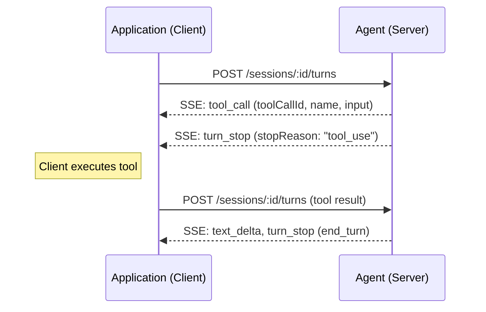
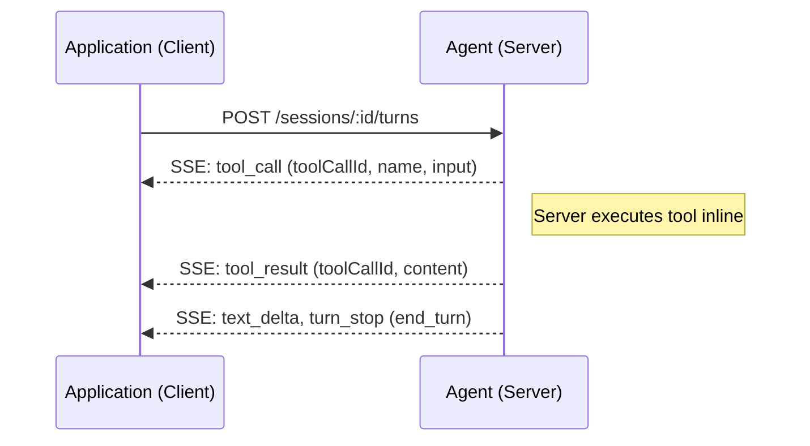
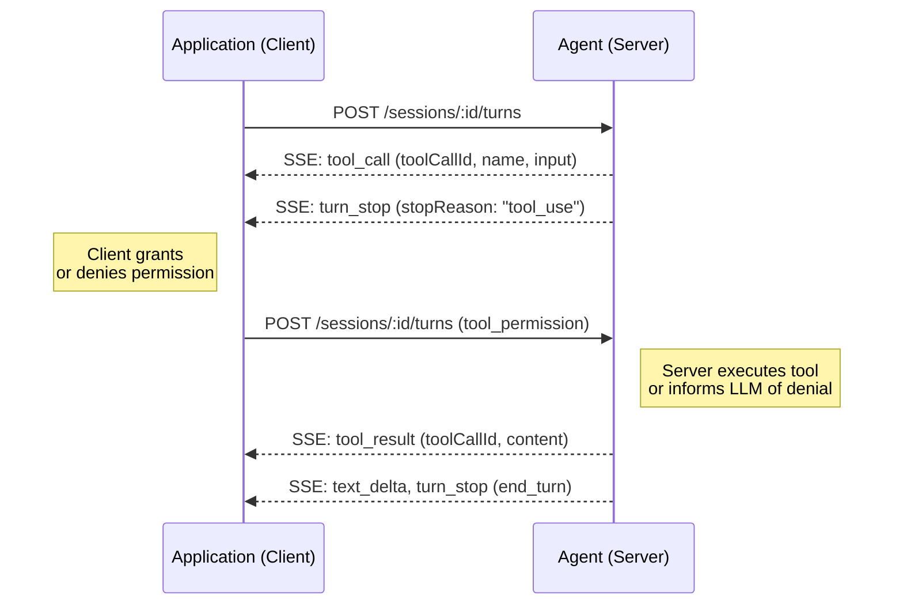
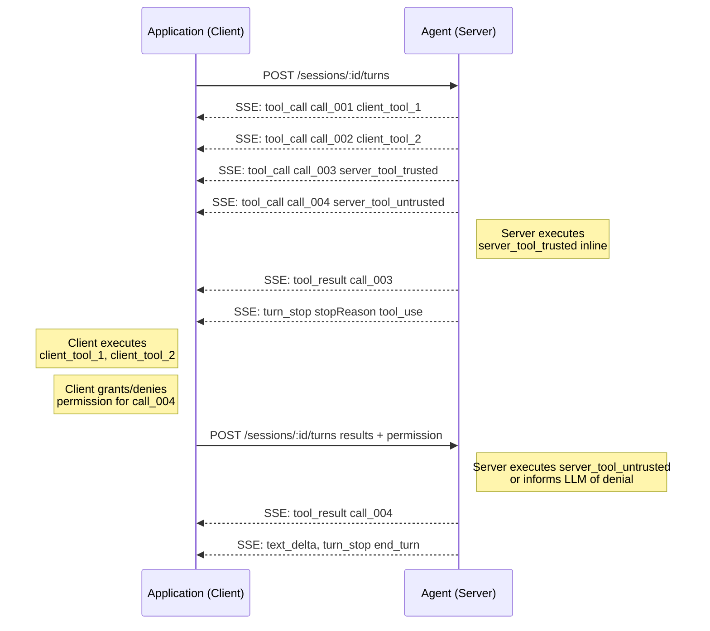

# Tool Call

## Tool Call Flow

### Client-side tool

### Server-side tool (trusted, inline)

### Server-side tool (permission required)

## Parallel tool calls

The server may emit multiple `tool_call` events before `turn_stop`. The client should handle all of them — execute application-side tools and respond to untrusted server tool permissions — then re-submit all results and permissions together in a single `POST /sessions/:id/turns`. Trusted server-side tools are handled inline by the server and do not require client action.

Example with two client-side tools, one trusted server tool, and one untrusted server tool — all called in parallel:

## Tool call resolving

### Server

After the LLM emits tool calls, the server resolves each one:

1. For each `tool_call`, check if it is a trusted server-side tool — if so, execute it inline immediately and emit a `tool_result` event.
2. If any tool calls remain unexecuted, emit `turn_stop` with `stopReason: "tool_use"`.
3. When the client re-submits, append the client-provided tool result messages to history.
4. For each `tool_permission` in the submission, find the matching `tool_call` by `toolCallId` — execute the tool if granted, or store a `tool` message with a denial description (e.g. `"Tool call denied"`, or `"Tool call denied: <reason>"` if a `reason` was provided) to inform the LLM. `tool_permission` messages are never appended to history — they are dropped after processing.
5. Append all `tool_result` events to history and continue the agent loop.

### Client

When the client receives `turn_stop` with `stopReason: "tool_use"`:

1. Collect all `tool_call` events from the current turn.
2. Ignore any whose `toolCallId` already has a matching `tool_result` — those were handled inline by the server.
3. For each remaining tool call, determine whether it is a client-side tool (by matching the name against tools declared in the request) or a server-side tool:
   - Client-side tool: optionally prompt the user whether to proceed, then execute it and collect the result.
   - Server-side tool: prompt the user or apply policy to grant or deny permission.
4. Submit all results and permissions together in a single `POST /sessions/:id/turns`.

## Tool call resumption

If a client has no in-memory state (e.g. after a restart or recovery), it can call `GET /sessions/:id/history` to retrieve the session history and resume from where it left off:

1. Fetch session history via `GET /sessions/:id/history`.
2. Inspect the last assistant message in history — if it has unresolved tool calls (no matching `tool` message in history), the last turn ended with `stopReason: "tool_use"` and requires client action.
3. Apply the same client-side resolving logic: identify application-side tools to execute and server-side tools requiring permission.
4. Submit results and permissions via `POST /sessions/:id/turns` to continue.
