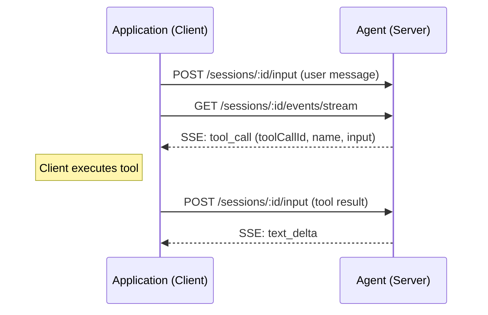
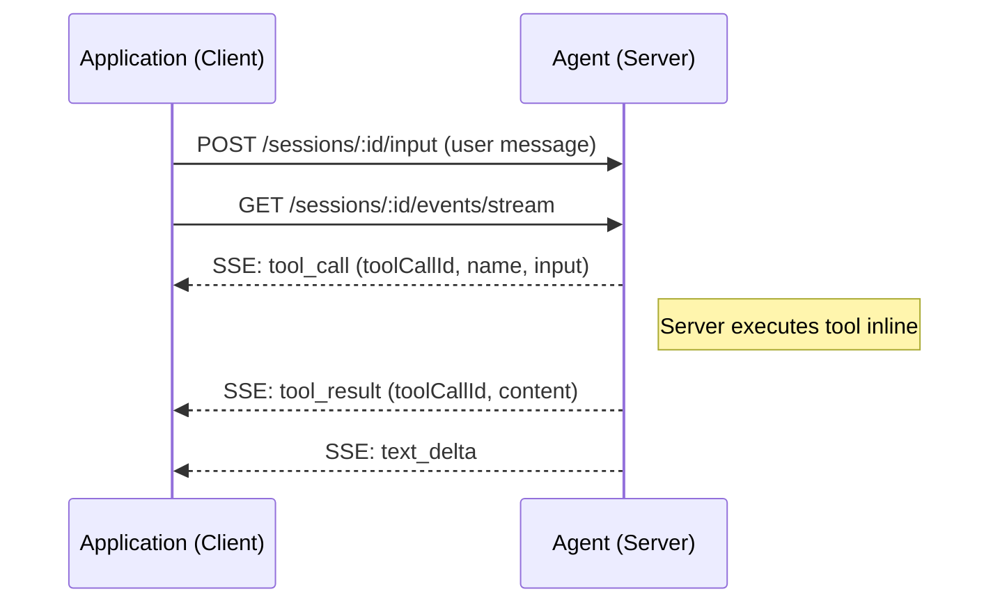
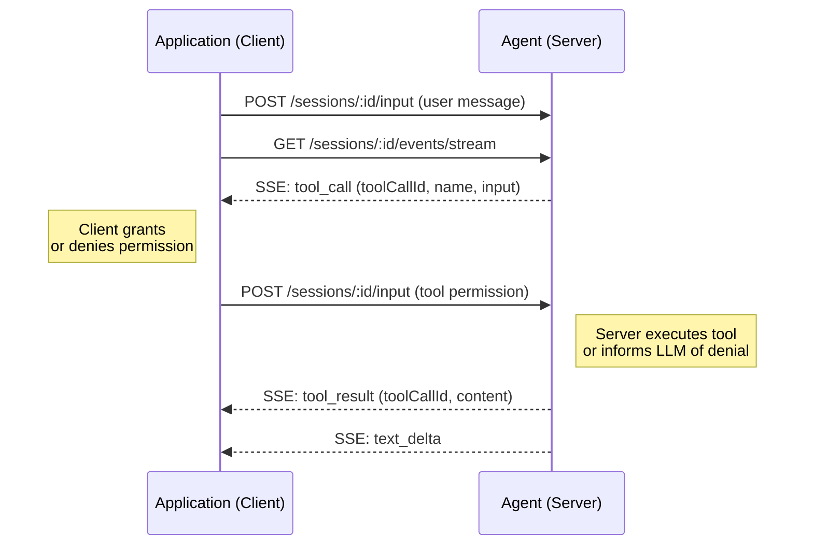
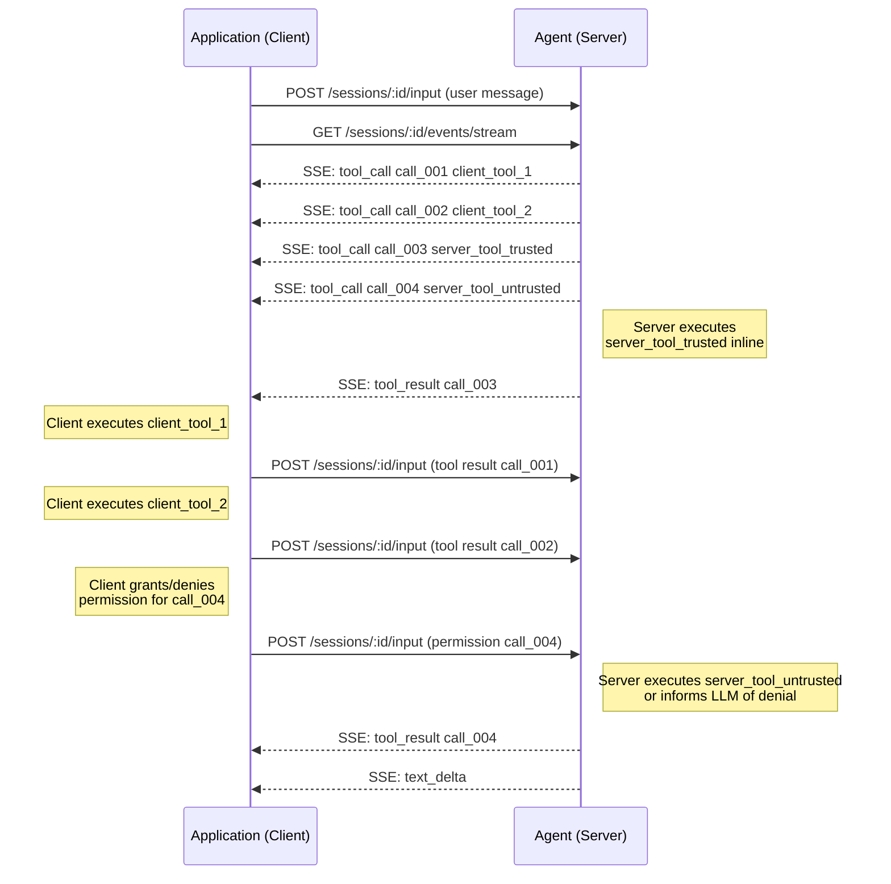

---
head:
  - - meta
    - name: description
      content: How Agent Application Protocol (AAP) handles tool calls — client-side and server-side tool flows, permissions, and tool call resumption.
  - - meta
    - property: og:title
      content: Tool Call — Agent Application Protocol
  - - meta
    - property: og:description
      content: How Agent Application Protocol (AAP) handles tool calls — client-side and server-side tool flows, permissions, and tool call resumption.
  - - meta
    - property: og:url
      content: https://agentapplicationprotocol.com/tool-call
  - - meta
    - name: twitter:title
      content: Tool Call — Agent Application Protocol
  - - meta
    - name: twitter:description
      content: How Agent Application Protocol (AAP) handles tool calls — client-side and server-side tool flows, permissions, and tool call resumption.
---

# Tool Call

## Tool Call Flow

### Client-side tool

```mermaid
sequenceDiagram
    participant App as Application (Client)
    participant Agent as Agent (Server)

    App->>Agent: POST /sessions/:id/input (user message)
    App->>Agent: GET /sessions/:id/events/stream
    Agent-->>App: SSE: tool_call (toolCallId, name, input)
    Note left of App: Client executes tool
    App->>Agent: POST /sessions/:id/input (tool result)
    Agent-->>App: SSE: text_delta
```

### Server-side tool (trusted, inline)

```mermaid
sequenceDiagram
    participant App as Application (Client)
    participant Agent as Agent (Server)

    App->>Agent: POST /sessions/:id/input (user message)
    App->>Agent: GET /sessions/:id/events/stream
    Agent-->>App: SSE: tool_call (toolCallId, name, input)
    Note right of Agent: Server executes tool inline
    Agent-->>App: SSE: tool_result (toolCallId, content)
    Agent-->>App: SSE: text_delta
```

### Server-side tool (permission required)

```mermaid
sequenceDiagram
    participant App as Application (Client)
    participant Agent as Agent (Server)

    App->>Agent: POST /sessions/:id/input (user message)
    App->>Agent: GET /sessions/:id/events/stream
    Agent-->>App: SSE: tool_call (toolCallId, name, input)
    Note left of App: Client grants<br/>or denies permission
    App->>Agent: POST /sessions/:id/input (tool permission)
    Note right of Agent: Server executes tool<br/>or informs LLM of denial
    Agent-->>App: SSE: tool_result (toolCallId, content)
    Agent-->>App: SSE: text_delta
```

## Unexposed server-side tools

The server may have internal tools that are not declared in [`GET /meta`](/endpoints#get-meta). The server may still stream `tool_call` and `tool_result` events for these tools so the client can observe them. Clients should be prepared to handle unknown tool names — either displaying them or discarding them.

## Parallel tool calls

The server may emit multiple `tool_call` events in sequence. Each result or permission is submitted individually via `POST /sessions/:id/input`. The client does not need to batch them. Trusted server-side tools are handled inline by the server and do not require client action.

Example with two client-side tools, one trusted server tool, and one untrusted server tool — all called in parallel:

```mermaid
sequenceDiagram
    participant App as Application (Client)
    participant Agent as Agent (Server)

    App->>Agent: POST /sessions/:id/input (user message)
    App->>Agent: GET /sessions/:id/events/stream
    Agent-->>App: SSE: tool_call call_001 client_tool_1
    Agent-->>App: SSE: tool_call call_002 client_tool_2
    Agent-->>App: SSE: tool_call call_003 server_tool_trusted
    Agent-->>App: SSE: tool_call call_004 server_tool_untrusted
    Note right of Agent: Server executes<br/>server_tool_trusted inline
    Agent-->>App: SSE: tool_result call_003
    Note left of App: Client executes client_tool_1
    App->>Agent: POST /sessions/:id/input (tool result call_001)
    Note left of App: Client executes client_tool_2
    App->>Agent: POST /sessions/:id/input (tool result call_002)
    Note left of App: Client grants/denies<br/>permission for call_004
    App->>Agent: POST /sessions/:id/input (permission call_004)
    Note right of Agent: Server executes server_tool_untrusted<br/>or informs LLM of denial
    Agent-->>App: SSE: tool_result call_004
    Agent-->>App: SSE: text_delta
```

## Tool call resolving

### Server

After the LLM emits tool calls, the server resolves each one:

1. For each `tool_call`, check if it is a trusted server-side tool — if so, execute it inline immediately and emit a `tool_result` event.
2. Persist any remaining unresolved tool calls as `pending`.
3. When the client submits a result or permission via `POST /sessions/:id/input`, validate the `toolCallId` — reject unknown or already-resolved IDs with `400 Bad Request`.
4. Append client-provided tool result messages to history.
5. For each `tool_permission`, find the matching `tool_call` by `toolCallId` — execute the tool if granted, or store a `tool` message with a denial description (e.g. `"Tool call denied"`, or `"Tool call denied: <reason>"` if a `reason` was provided) to inform the LLM. `tool_permission` inputs are control input and are not appended to model-visible history.
6. Append all `tool_result` events to history and continue the agent loop.

### Client

When the client receives a `tool_call` event, it determines whether to act by matching the tool name against the client-side tools declared when creating or updating the session:

- **Client-side tool** — execute the tool and submit the result via `POST /sessions/:id/input` with `type: "tool"`.
- **Server-side tool with `trust: false`** — prompt the user or apply policy, then submit a `type: "permission"` input to grant or deny execution.
- **Server-side tool with `trust: true`** — the server executes it inline and emits a `tool_result` event. No client action is needed.
- **Unknown tool** — handle gracefully by displaying or discarding. Unknown tool calls are server-internal tools the agent chose not to expose.

Each result or permission is submitted individually. The client does not need to wait for all tool calls before submitting.

## Multiple subscribers

Multiple clients can connect to the same session event stream simultaneously. All subscribers receive the same events — including `tool_call` events. This means multiple clients may show UI for the same tool call at the same time.

Clients must handle this gracefully:

- When a client receives a `tool_call` event, show the appropriate UI (execute the tool or prompt for permission).
- When a client receives an `input` event with `type: "tool"` or `type: "permission"` for a `toolCallId` that is currently pending in its UI, another subscriber has already resolved it — dismiss the UI for that tool call immediately.
- Do not submit a result or permission for a tool call that has already been resolved. The server will reject it with `400 Bad Request`.

## Tool call resumption

If a client has no in-memory state (e.g. after a restart or reconnect), it calls [`GET /sessions/:id`](/endpoints#get-sessions-id) to retrieve `pending` and resume:

1. Fetch the session via [`GET /sessions/:id`](/endpoints#get-sessions-id).
2. If `pending` is non-empty, there are tool calls waiting for client action.
3. For each pending tool call, match the tool name against declared client-side tools to determine whether to submit a `tool` result or a `permission`.
4. Submit each result or permission individually via [`POST /sessions/:id/input`](/endpoints#post-sessions-id-input).

Clients may also call [`GET /sessions/:id/history`](/endpoints#get-sessions-id-history) for display, auditing, or fallback recovery.
