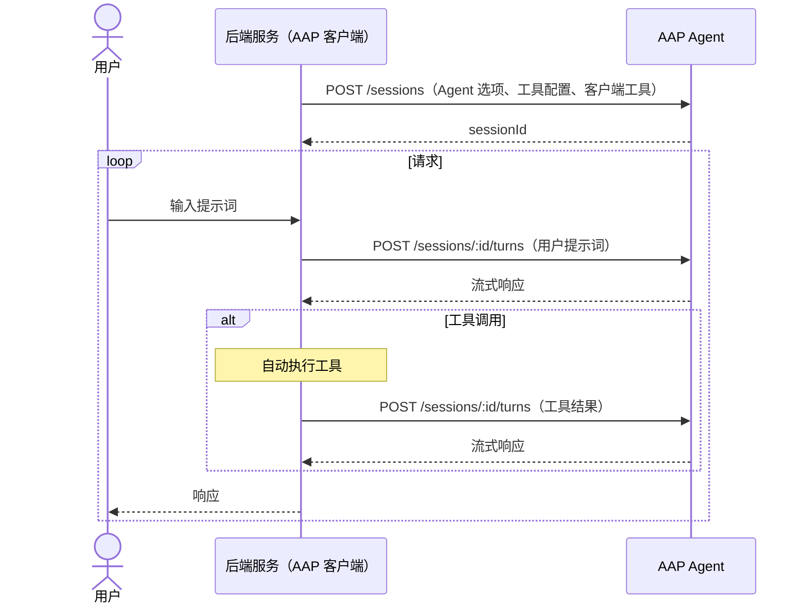

---
head:
  - - meta
    - name: description
      content: 将 Agent Application Protocol (AAP) Agent 用作内部微服务 —— 任意后端服务通过 HTTP 将推理和决策委托给 Agent。
  - - meta
    - property: og:title
      content: Agent 作为微服务 — Agent Application Protocol
  - - meta
    - property: og:description
      content: 将 Agent Application Protocol (AAP) Agent 用作内部微服务 —— 任意后端服务通过 HTTP 将推理和决策委托给 Agent。
  - - meta
    - property: og:url
      content: https://agentapplicationprotocol.com/zh/agent-as-a-microservice
  - - meta
    - name: twitter:title
      content: Agent 作为微服务 — Agent Application Protocol
  - - meta
    - name: twitter:description
      content: 将 Agent Application Protocol (AAP) Agent 用作内部微服务 —— 任意后端服务通过 HTTP 将推理和决策委托给 Agent。
---

# Agent 作为微服务

AAP Agent 可以作为系统内部的服务使用 —— 不仅限于面向用户的应用。任何后端服务都可以作为 AAP 客户端，通过 HTTP 将推理或决策委托给 Agent。

这使 Agent 能力与业务逻辑分离。Agent 研发团队维护通用 Agent；产品研发团队通过Agent名和少量配置选项使用这些Agent，无需了解 Agent 实现细节。

## 职责划分

| 职责             | 后端服务（AAP 客户端） | AAP Agent |
| ---------------- | ---------------------- | --------- |
| 业务逻辑         | ✅                     |           |
| 领域专属工具     | ✅                     |           |
| 会话管理         | ✅                     |           |
| Agent 循环 & LLM |                        | ✅        |
| 通用工具         |                        | ✅        |
| 对话历史存储     |                        | ✅        |

## 架构



用户无需参与Agent循环 —— 工具调用自动执行，调用结果立即提交给Agent，无需向用户显示权限提示。

## 第一步：配置你的 Agent

预先决定：

- 使用哪个 AAP Agent ，以及如何配置其 Agent 选项
- 启用和信任哪些服务端工具
- 后端服务提供哪些客户端工具（如查询数据库或内部 API）

## 第二步：创建会话

使用预配置的 Agent 选项、服务端工具配置和客户端工具创建会话：

```http
POST /sessions
Authorization: Bearer <api-key>
Content-Type: application/json

{
  "agent": {
    "name": "company-agent",
    "tools": [{ "name": "web_search", "trust": true }],
    "options": { "language": "Chinese" }
  },
  "tools": [
    {
      "name": "get_policy_document",
      "description": "按名称检索 HR 政策文档。",
      "parameters": {
        "type": "object",
        "properties": {
          "name": { "type": "string", "description": "政策文档名称" }
        },
        "required": ["name"]
      }
    }
  ]
}
```

## 第三步：发送轮次

向会话发送用户提示词：

```http
POST /sessions/sess_abc123/turns
Authorization: Bearer <api-key>
Content-Type: application/json

{
  "stream": "delta",
  "messages": [{ "role": "user", "content": "育儿假政策是什么？" }]
}
```

## 第四步：自动处理工具调用

Agent 每次响应后，后端服务使用 AAP SDK 提取所有客户端工具调用。与面向用户的应用不同，后端服务立即执行所有工具，无需提示用户：

1. 对于每个 `tool_call`，在后端服务中执行该工具。
2. 将所有结果汇总到单个轮次请求中提交。
3. 重复，直到没有未解决的工具调用。

对于服务端工具，设置 `trust: true` 让 Agent 内联运行它们而不停止。

完整的工具调用解析流程，见[工具调用](/zh/tool-call)。

## 第五步：管理会话

请求完成后，后端服务可以决定是立即删除会话还是保留一段时间以允许后续轮次，当不再需要历史记录时再删除它，以释放 Agent 服务器上的资源：

```http
DELETE /sessions/sess_abc123
Authorization: Bearer <api-key>
```

完整详情见[端点](/zh/endpoints)。
