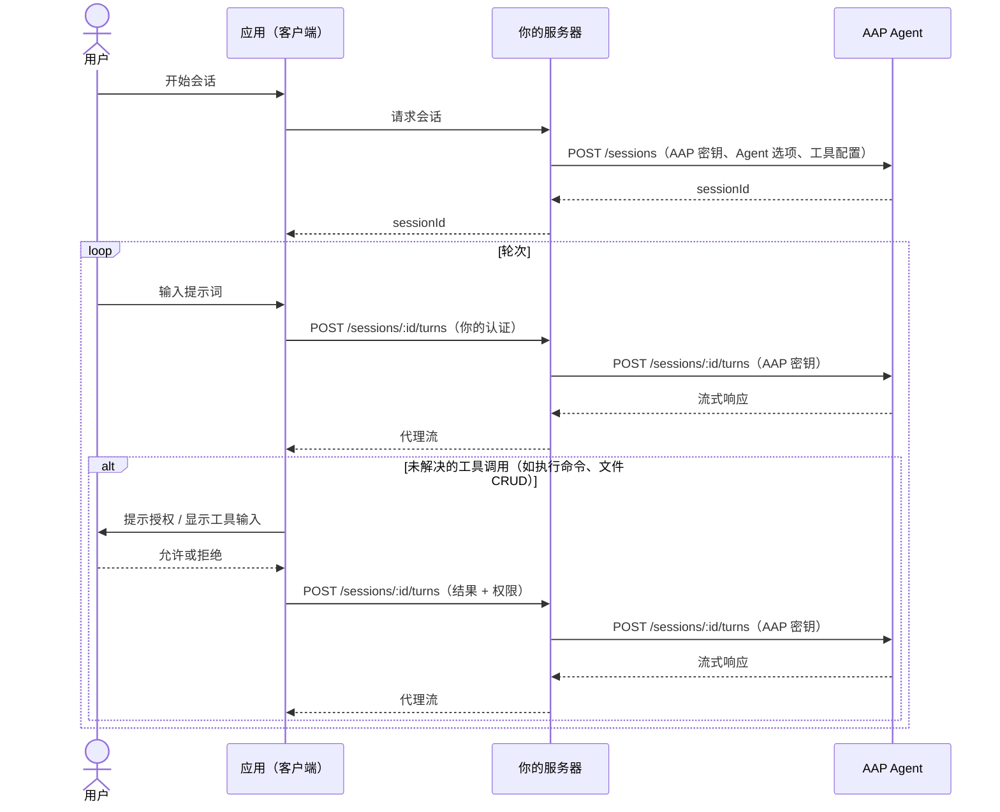

---
head:
  - - meta
    - name: description
      content: 教程 —— 构建托管 Agent Application Protocol (AAP) 应用，由你控制 Agent。你的服务器代理所有请求，实现完全的过滤和路由控制。
  - - meta
    - property: og:title
      content: 构建托管 Agent 应用 — Agent Application Protocol
  - - meta
    - property: og:description
      content: 教程 —— 构建托管 Agent Application Protocol (AAP) 应用，由你控制 Agent。你的服务器代理所有请求，实现完全的过滤和路由控制。
  - - meta
    - property: og:url
      content: https://agentapplicationprotocol.com/zh/build-a-managed-app
  - - meta
    - name: twitter:title
      content: 构建托管 Agent 应用 — Agent Application Protocol
  - - meta
    - name: twitter:description
      content: 教程 —— 构建托管 Agent Application Protocol (AAP) 应用，由你控制 Agent。你的服务器代理所有请求，实现完全的过滤和路由控制。
---

# 构建托管 Agent 应用

托管 Agent 应用意味着你的应用控制使用哪个 AAP Agent —— 用户无需配置 Agent 提供商。你选择 Agent、选项和工具配置；你支付 AAP 使用费用。

你的服务器位于客户端和 AAP Agent 之间，处理所有请求。客户端从不直接与 AAP Agent 通信，让你完全控制请求和响应过滤。

托管应用中的客户端工具通常在用户环境中运行 —— 读写文件、执行 shell 命令、查询本地数据。由于这些操作可能涉及敏感内容，应用在执行前应提示用户授权。

## 你需要实现的内容

| 职责             | 你的应用（客户端） | 你的服务器         | AAP Agent |
| ---------------- | ------------------ | ------------------ | --------- |
| UI 与用户输入    | ✅                 |                    |           |
| 客户端工具       | ✅                 |                    |           |
| 会话创建         | ✅ → 经由服务器    | ✅ 代理            |           |
| 轮次请求         | ✅ → 经由服务器    | ✅ 代理 + 流式传输 |           |
| 请求/响应过滤    |                    | ✅                 |           |
| Agent 循环 & LLM |                    |                    | ✅        |
| 服务端工具       |                    |                    | ✅        |
| 会话历史         |                    |                    | ✅        |

## 架构



## 第一步：配置你的 Agent（构建时）

发布应用前，决定：

- 使用哪个 AAP Agent 提供商和 Agent
- Agent 选项（如模型、语言）
- 启用哪些服务端工具以及哪些信任
- 你的应用提供哪些客户端工具

这些配置固化在你的服务器中 —— 用户永远看不到也无法更改。

## 第二步：认证用户

用户打开应用时，使用你现有的认证机制（如 OAuth、会话 Cookie、JWT）对其进行认证。

## 第三步：通过你的服务器创建会话

客户端请求你的服务器创建会话。你的服务器使用长期有效的 AAP API 密钥调用 AAP Agent 的 `POST /sessions`，携带预配置的 Agent 选项和工具配置。你的服务器只将 `sessionId` 返回给客户端 —— AAP 密钥永远不离开你的服务器。

## 第四步：通过你的服务器发送轮次

客户端将轮次发送到你的服务器（使用你自己的认证），你的服务器将其代理到 AAP Agent 并将响应流式传回：

```
客户端 → POST /your-server/sessions/:id/turns
       → 你的服务器 → POST /aap-agent/sessions/:id/turns
                     ← 流式响应
       ← 代理流
```

你的服务器可以在此层检查或过滤请求和响应。

## 第五步：处理工具调用

每次响应后，AAP SDK 提取所有未解决的工具调用 —— 需执行的客户端工具和等待授权的不受信任服务端工具。

**若存在未解决的工具调用**，对每个工具调用提示用户：

- 显示工具名称和描述。
- 使用工具的输入 schema 展示每个参数名称、值和描述。
- 询问用户允许或拒绝（或通过 `agent.tools` 覆盖更新信任）。

将所有结果和权限汇总到单个轮次请求中，通过你的服务器代理提交。

**若没有未解决的工具调用**，询问用户下一条消息并返回第四步。

完整解决流程见[工具调用](/zh/tool-call)。

## 第六步：管理会话

通过你的服务器代理会话端点，让用户列出、查看和删除会话。你的服务器使用你的 API 密钥将请求转发给 AAP Agent。完整请求和响应详情见[端点](/zh/endpoints)。
