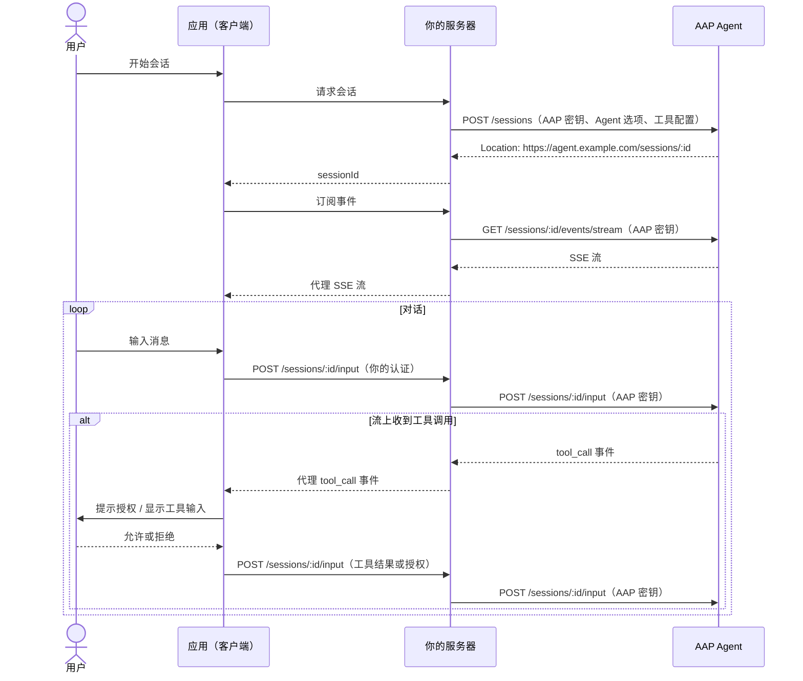

---
head:
  - - meta
    - name: description
      content: 教程 —— 构建托管 Agent Application Protocol (AAP) 应用，由你控制 Agent。你的服务器代理所有请求，实现完全的过滤和路由控制。
  - - meta
    - property: og:title
      content: 构建托管 Agent 应用 — Agent Application Protocol
  - - meta
    - property: og:description
      content: 教程 —— 构建托管 Agent Application Protocol (AAP) 应用，由你控制 Agent。你的服务器代理所有请求，实现完全的过滤和路由控制。
  - - meta
    - property: og:url
      content: https://agentapplicationprotocol.com/zh/build-a-managed-app
  - - meta
    - name: twitter:title
      content: 构建托管 Agent 应用 — Agent Application Protocol
  - - meta
    - name: twitter:description
      content: 教程 —— 构建托管 Agent Application Protocol (AAP) 应用，由你控制 Agent。你的服务器代理所有请求，实现完全的过滤和路由控制。
---

# 构建托管 Agent 应用

托管 Agent 应用意味着你的应用控制使用哪个 AAP Agent —— 用户无需配置 Agent 提供商。你选择 Agent、选项和工具配置；你支付 AAP 使用费用。

你的服务器位于客户端和 AAP Agent 之间，处理所有请求。客户端从不直接与 AAP Agent 通信，让你完全控制请求和响应过滤。

托管应用中的客户端工具通常在用户环境中运行 —— 读写文件、执行 shell 命令、查询本地数据。由于这些操作可能涉及敏感内容，应用在执行前应提示用户授权。

## 你需要实现的内容

| 职责             | 你的应用（客户端） | 你的服务器         | AAP Agent |
| ---------------- | ------------------ | ------------------ | --------- |
| UI 与用户输入    | ✅                 |                    |           |
| 客户端工具       | ✅                 |                    |           |
| 会话创建         | ✅ → 经由服务器    | ✅ 代理            |           |
| 事件流订阅       | ✅ → 经由服务器    | ✅ 代理 + 流式传输 |           |
| 输入发布         | ✅ → 经由服务器    | ✅ 代理            |           |
| 请求/响应过滤    |                    | ✅                 |           |
| Agent 循环 & LLM |                    |                    | ✅        |
| 服务端工具       |                    |                    | ✅        |
| 会话历史         |                    |                    | ✅        |

## 架构


```mermaid
sequenceDiagram
    actor User as 用户
    participant App as 应用（客户端）
    participant Server as 你的服务器
    participant Agent as AAP Agent

    User->>App: 开始会话
    App->>Server: 请求会话
    Server->>Agent: POST /sessions（AAP 密钥、Agent 选项、工具配置）
    Agent-->>Server: Location: https://agent.example.com/sessions/:id
    Server-->>App: sessionId

    App->>Server: 订阅事件
    Server->>Agent: GET /sessions/:id/events/stream（AAP 密钥）
    Agent-->>Server: SSE 流
    Server-->>App: 代理 SSE 流

    loop 对话
        User->>App: 输入消息
        App->>Server: POST /sessions/:id/input（你的认证）
        Server->>Agent: POST /sessions/:id/input（AAP 密钥）

        alt 流上收到工具调用
            Agent-->>Server: tool_call 事件
            Server-->>App: 代理 tool_call 事件
            App->>User: 提示授权 / 显示工具输入
            User-->>App: 允许或拒绝
            App->>Server: POST /sessions/:id/input（工具结果或授权）
            Server->>Agent: POST /sessions/:id/input（AAP 密钥）
        end
    end
```

## 第一步：配置你的 Agent（构建时）

发布应用前，决定：

- 使用哪个 AAP Agent 提供商和 Agent
- Agent 选项（如模型、语言）
- 启用哪些服务端工具以及哪些信任
- 你的应用提供哪些客户端工具

这些配置固化在你的服务器中 —— 用户永远看不到也无法更改。

## 第二步：认证用户

用户打开应用时，使用你现有的认证机制（如 OAuth、会话 Cookie、JWT）对其进行认证。

## 第三步：通过你的服务器创建会话

客户端请求你的服务器创建会话。你的服务器使用长期有效的 AAP API 密钥调用 AAP Agent 的 [`POST /sessions`](/zh/endpoints#post-sessions)，携带预配置的 Agent 选项和工具配置。AAP Agent 在 `Location` 响应头中以绝对 URL 返回会话 URL —— 例如 `https://agent.example.com/sessions/sess_abc123`。你的服务器提取会话 ID，并只将该 ID 返回给客户端。AAP 密钥永远不离开你的服务器。

## 第四步：通过你的服务器订阅事件流并代理输入

会话创建后，你的服务器向 AAP Agent 的事件流建立长期代理连接并将其管道传输给客户端：

```
客户端 → GET /your-server/sessions/:id/events/stream
       → 你的服务器 → GET /aap-agent/sessions/:id/events/stream（AAP 密钥）
                     ← SSE 流
       ← 代理 SSE 流
```

用户消息和工具结果通过你的服务器以短 HTTP 请求提交：

```
客户端 → POST /your-server/sessions/:id/input
       → 你的服务器 → POST /aap-agent/sessions/:id/input（AAP 密钥）
```

你的服务器可以在此层检查或过滤事件流和输入请求。

## 第五步：处理工具调用

当客户端在流上收到 `tool_call` 事件时，判断该工具是客户端工具还是不受信任的服务端工具。

**对于客户端工具**，对每个工具提示用户：

- 显示工具名称和描述。
- 使用工具的输入 schema 展示每个参数名称、值和描述。
- 询问用户允许或拒绝。

执行被允许的工具，并通过你的服务器代理逐个提交结果：

```json
{
  "type": "tool",
  "toolCallId": "call_001",
  "content": "Tokyo: 18°C, partly cloudy"
}
```

被拒绝的工具以授权拒绝形式提交：

```json
{
  "type": "permission",
  "toolCallId": "call_002",
  "granted": false,
  "reason": "User denied file system access."
}
```

每个结果或授权决定作为单独的 `POST /sessions/:id/input` 请求提交 —— 不要批量合并。若要在未来轮次中自动允许某个服务端工具，请使用 [`PATCH /sessions/:id`](/zh/endpoints#patch-sessions-id) 更新会话的服务端工具设置。

完整解决流程见[工具调用](/zh/tool-call)。

## 第六步：管理会话

通过你的服务器代理会话端点，让用户列出、查看和删除会话。你的服务器使用你的 API 密钥将请求转发给 AAP Agent。完整请求和响应详情见[端点](/zh/endpoints)。
