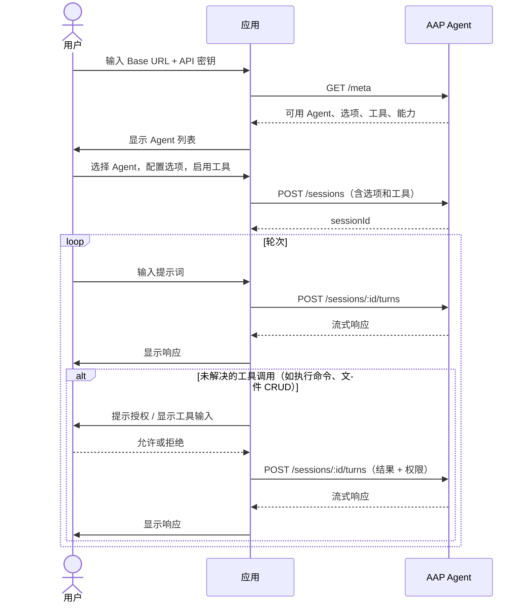

---
head:
  - - meta
    - name: description
      content: 教程 —— 构建开放的 Agent Application Protocol (AAP) 应用，使用户接入自定义的 Agent。
  - - meta
    - property: og:title
      content: 构建开放的 Agent 应用 — Agent Application Protocol
  - - meta
    - property: og:description
      content: 教程 —— 构建开放的 Agent Application Protocol (AAP) 应用，使用户接入自定义的 Agent。
  - - meta
    - property: og:url
      content: https://agentapplicationprotocol.com/zh/build-an-open-app
  - - meta
    - name: twitter:title
      content: 构建开放的 Agent 应用 — Agent Application Protocol
  - - meta
    - name: twitter:description
      content: 教程 —— 构建开放的 Agent Application Protocol (AAP) 应用，使用户接入自定义的 Agent。
---

# 构建开放的 Agent 应用

开放的 Agent 应用允许用户接入自定义的 AAP Agent —— 用户配置服务器 URL 和 API 密钥，您的应用连接到用户选择的任意 Agent。无供应商锁定，无需后端。

这与 [AAP Web Playground](https://agentapplicationprotocol.github.io/playground/)的模式相同。

开放应用中的客户端工具通常直接在用户环境中运行 —— 读写文件、执行 shell 命令、查询本地数据。由于这些操作可能涉及敏感内容，应用在执行前应提示用户授权。

## 应用需要实现的内容

| 职责             | 应用 | AAP Agent |
| ---------------- | ---- | --------- |
| UI 与用户输入    | ✅   |           |
| 客户端工具       | ✅   |           |
| Agent 循环 & LLM |      | ✅        |
| 服务端工具       |      | ✅        |
| 会话历史         |      | ✅        |

应用只需要实现 AAP 客户端 —— 无需后端、无需实现 Agent 循环、无需实现 LLM 集成。

## 架构



## 第一步：用户提供AAP Agent配置

显示包含两个字段的设置表单：

- **AAP Base URL** —— 例如 `https://api.example.com/v1`
- **API 密钥** —— 每次请求通过 `Authorization: Bearer <key>` 传递

## 第二步：获取可用 Agent

调用 `GET /meta` 发现服务器提供的 Agent：

```http
GET /meta
Authorization: Bearer <api-key>
```

响应包含每个 Agent 的名称、描述、可配置选项、工具和能力。完整响应 schema 见 [端点](/zh/endpoints#get-meta)。

使用 `capabilities` 过滤出支持你应用所需功能的 Agent（如流式传输、图片输入、客户端工具）。

## 第三步：让用户选择 Agent 并配置选项

渲染 Agent 列表，用户选择后显示包含两个部分的表单：

**选项** —— 每个选项有 `type`（`text`、`select` 或 `secret`）和 `default`。

**服务端工具** —— Agent 的 `tools` 数组列出其暴露给客户端配置的工具。每个工具有 `name`、`description` 和 `parameters`（输入 schema）。对于每个工具，让用户：

- **启用/禁用** —— 只有启用的工具才会在创建会话时通过 `agent.tools` 传递。
- **信任** —— 若信任（`trust: true`），Agent 内联调用工具无需停止请求权限。若不信任，运行时你的应用会收到 `tool_call` 事件，必须提示用户授权或拒绝 —— 工具的 `description` 和 `parameters` 就是在提示中展示的内容。

## 第四步：创建会话

用户准备好后，使用所选 Agent、其选项、服务端工具配置以及应用提供的客户端工具创建会话：

```http
POST /sessions
Authorization: Bearer <api-key>
Content-Type: application/json

{
  "agent": {
    "name": "research-agent",
    "tools": [{ "name": "web_search", "trust": true }],
    "options": { "language": "Chinese" }
  },
  "tools": [
    {
      "name": "get_current_document",
      "description": "返回编辑器中当前打开文档的内容。",
      "parameters": { "type": "object", "properties": {} }
    }
  ]
}
```

响应：

```json
{ "sessionId": "sess_abc123" }
```

保存 `sessionId` —— 每次轮次都会用到它。

此处声明的客户端工具在会话期间持久保存。

## 第五步：发送轮次并处理响应

将每条用户消息发送到会话。你可以在每次轮次中覆盖 Agent 选项、服务端工具配置和客户端工具 —— 会话创建后不能更改 Agent：

```http
POST /sessions/sess_abc123/turns
Authorization: Bearer <api-key>
Content-Type: application/json

{
  "stream": "delta",
  "messages": [{ "role": "user", "content": "总结最新的 AI 新闻。" }],
  "agent": {
    "tools": [{ "name": "web_search", "trust": false }],
    "options": { "language": "English" }
  },
  "tools": [
    {
      "name": "get_current_document",
      "description": "返回编辑器中当前打开文档的内容。",
      "parameters": { "type": "object", "properties": {} }
    }
  ]
}
```

将响应流式传输给用户。关于如何处理 `delta`、`message` 和 `none` 流类型，见[响应模式](/zh/response)。

## 第六步：处理下一轮次

收到响应后，AAP SDK 解析并提取所有未解决的工具调用 —— 应用需执行的客户端工具，以及等待授权的不受信任服务端工具。

**若存在未解决的工具调用**，对每个工具调用提示用户：

- 显示工具名称和描述。
- 使用工具的输入 schema 展示每个参数名称、值和描述，让用户了解将要执行的内容。
- 询问用户允许或拒绝（或通过 `agent.tools` 覆盖更新信任，以便在未来轮次中自动允许）。

用户响应所有提示后，将所有工具结果和权限汇总到单个轮次请求中提交。服务端会将你包含的任何 `agent` 或 `tools` 的覆盖持久化到会话中。

**若没有未解决的工具调用**，本轮次完成 —— 询问用户下一条消息并返回第五步。

完整工具调用解析流程见[工具调用](/zh/tool-call)。

## 第七步：管理会话

使用会话端点让用户查看和管理历史会话。

**列出会话** —— 分页获取服务器上的所有会话：

```http
GET /sessions
GET /sessions?after=<cursor>
Authorization: Bearer <api-key>
```

返回 `sessions` 数组和可选的 `next` 游标用于下一页。

**获取会话** —— 获取特定会话及其配置：

```http
GET /sessions/sess_abc123
Authorization: Bearer <api-key>
```

**删除会话** —— 删除会话及其历史：

```http
DELETE /sessions/sess_abc123
Authorization: Bearer <api-key>
```

成功返回 `204 No Content`。

**获取会话历史** —— 获取会话的对话历史（仅当 Agent 在 `GET /meta` 中声明了历史能力时可用）：

```http
GET /sessions/sess_abc123/history?type=compacted
Authorization: Bearer <api-key>
```

`type` 为 `compacted` 或 `full`，取决于 Agent 通过 `capabilities.history` 支持的类型。

完整请求和响应详情见[端点](/zh/endpoints)。
