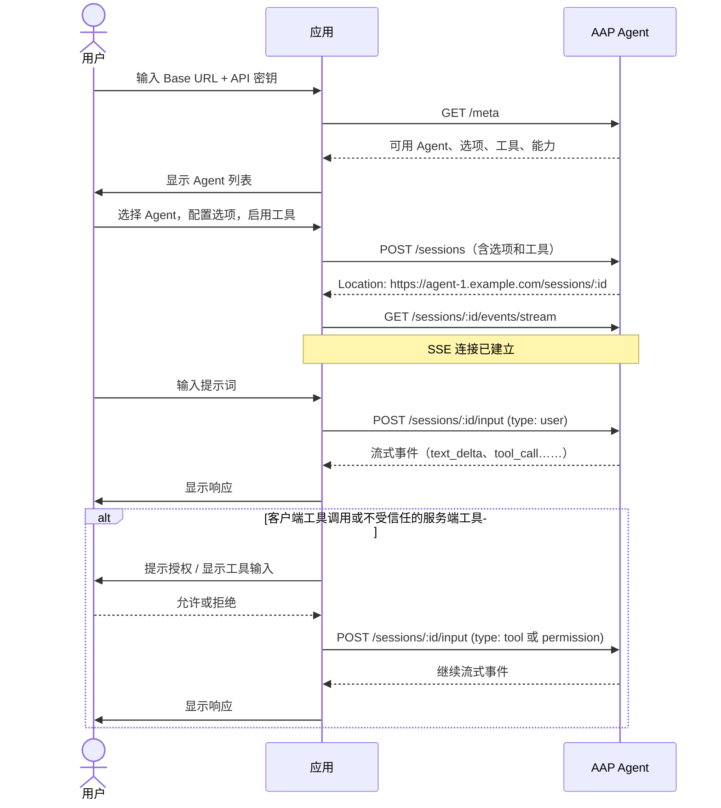

---
head:
  - - meta
    - name: description
      content: 教程 —— 构建开放的 Agent Application Protocol (AAP) 应用，使用户接入自定义的 Agent。
  - - meta
    - property: og:title
      content: 构建开放的 Agent 应用 — Agent Application Protocol
  - - meta
    - property: og:description
      content: 教程 —— 构建开放的 Agent Application Protocol (AAP) 应用，使用户接入自定义的 Agent。
  - - meta
    - property: og:url
      content: https://agentapplicationprotocol.com/zh/build-an-open-app
  - - meta
    - name: twitter:title
      content: 构建开放的 Agent 应用 — Agent Application Protocol
  - - meta
    - name: twitter:description
      content: 教程 —— 构建开放的 Agent Application Protocol (AAP) 应用，使用户接入自定义的 Agent。
---

# 构建开放的 Agent 应用

开放的 Agent 应用允许用户接入自定义的 AAP Agent —— 用户配置服务器 URL 和 API 密钥，您的应用连接到用户选择的任意 Agent。无供应商锁定，无需后端。

这与 [AAP Web Playground](https://agentapplicationprotocol.github.io/playground/) 的模式相同。

开放应用中的客户端工具通常直接在用户环境中运行 —— 读写文件、执行 shell 命令、查询本地数据。由于这些操作可能涉及敏感内容，应用在执行前应提示用户授权。

## 应用需要实现的内容

| 职责             | 应用 | AAP Agent |
| ---------------- | ---- | --------- |
| UI 与用户输入    | ✅   |           |
| 客户端工具       | ✅   |           |
| Agent 循环 & LLM |      | ✅        |
| 服务端工具       |      | ✅        |
| 会话历史         |      | ✅        |

应用只需要实现 AAP 客户端 —— 无需后端、无需实现 Agent 循环、无需实现 LLM 集成。

## 架构


```mermaid
sequenceDiagram
    actor User as 用户
    participant App as 应用
    participant Agent as AAP Agent

    User->>App: 输入 Base URL + API 密钥
    App->>Agent: GET /meta
    Agent-->>App: 可用 Agent、选项、工具、能力
    App->>User: 显示 Agent 列表
    User->>App: 选择 Agent，配置选项，启用工具
    App->>Agent: POST /sessions（含选项和工具）
    Agent-->>App: Location: https://agent-1.example.com/sessions/:id
    App->>Agent: GET /sessions/:id/events/stream
    Note over App,Agent: SSE 连接已建立
    User->>App: 输入提示词
    App->>Agent: POST /sessions/:id/input (type: user)
    Agent-->>App: 流式事件（text_delta、tool_call……）
    App->>User: 显示响应
    alt 客户端工具调用或不受信任的服务端工具
        App->>User: 提示授权 / 显示工具输入
        User-->>App: 允许或拒绝
        App->>Agent: POST /sessions/:id/input (type: tool 或 permission)
        Agent-->>App: 继续流式事件
        App->>User: 显示响应
    end
```

## 第一步：收集连接设置

显示包含两个字段的设置表单：

- **AAP Base URL** —— 例如 `https://api.example.com/v1`
- **API 密钥** —— 每次请求通过 `Authorization: Bearer <key>` 传递

## 第二步：获取可用 Agent

调用 [`GET /meta`](/zh/endpoints#get-meta) 发现服务器提供的 Agent：

```http
GET /meta
Authorization: Bearer <api-key>
```

响应包含每个 Agent 的名称、描述、可配置选项、工具和能力。完整响应 schema 见[端点](/zh/endpoints#get-meta)。

使用 `capabilities` 过滤出支持你应用所需功能的 Agent（如流式传输、图片输入、客户端工具）。

## 第三步：让用户选择 Agent 并配置选项

渲染 Agent 列表，用户选择后显示包含两个部分的表单：

**选项** —— 每个选项有 `type`（`text`、`select` 或 `secret`）和 `default`。

**服务端工具** —— Agent 的 `tools` 数组列出其暴露给客户端配置的工具。每个工具有 `name`、`description` 和 `parameters`（输入 schema）。对于每个工具，让用户：

- **启用/禁用** —— 只有启用的工具才会在创建会话时通过 `agent.tools` 传递。
- **信任** —— 若信任（`trust: true`），Agent 内联调用工具无需停止请求权限。若不信任，运行时你的应用会收到 `tool_call` 事件，必须提示用户授权或拒绝 —— 工具的 `description` 和 `parameters` 就是在提示中展示的内容。

## 第四步：创建会话

用户准备好后，使用所选 Agent、其选项、服务端工具配置以及应用提供的客户端工具创建会话：

```http
POST /sessions
Authorization: Bearer <api-key>
Content-Type: application/json

{
  "agent": {
    "name": "research-agent",
    "tools": [{ "name": "web_search", "trust": true }],
    "options": { "language": "English" }
  },
  "tools": [
    {
      "name": "get_current_document",
      "description": "Returns the content of the document currently open in the editor.",
      "parameters": { "type": "object", "properties": {} }
    }
  ]
}
```

响应：

```http
HTTP/1.1 201 Created
Location: https://agent-1.example.com/sessions/sess_abc123
```

`Location` 响应头包含已创建会话的绝对 URL。提取并保存它 —— 该会话上的所有后续请求（包括 `/input`、`/events/stream` 和 `/history`）都必须使用此 URL 作为基址。在分布式部署中，会话可能托管在与 `POST /sessions` 请求所发往的服务不同的源上。

此处声明的客户端工具在会话期间持久保存。

## 第五步：订阅事件流并发送消息

在发送用户输入之前，先订阅会话事件流：

```http
GET /sessions/sess_abc123/events/stream?stream=delta
Authorization: Bearer <api-key>
```

这将建立一个持久的 SSE 连接。服务器会先回放尚未持久化到历史的所有事件，然后在新事件发生时实时推送。在会话的整个生命周期内保持此连接 —— 它会传递所有 Agent 输出，包括文本、工具调用和状态变更。

订阅后，将用户消息发送到会话收件箱：

```http
POST /sessions/sess_abc123/input
Authorization: Bearer <api-key>
Content-Type: application/json

{
  "type": "user",
  "content": "Summarize the latest AI news."
}
```

服务器将输入入队，向所有订阅者发出 `input` 事件，并将其交付给活跃的会话工作器。Agent 输出通过你已打开的 SSE 流到达。

若要更改 Agent 选项、服务端工具配置或客户端工具，请使用 [`PATCH /sessions/:id`](/zh/endpoints#patch-sessions-id) 更新会话。

## 第六步：处理工具调用

Agent 运行时，可能会通过 SSE 流发出 `tool_call` 事件，用于需要你应用执行的客户端工具，或需要用户授权的不受信任服务端工具。

对于每个 `tool_call` 事件：

- 显示工具名称和描述。
- 使用工具的输入 schema 展示每个参数名称、值和描述，让用户了解将要执行的内容。
- 询问用户允许或拒绝。

每个结果或授权决定在解决后立即单独提交 —— 不要等待批量提交：

```http
POST /sessions/sess_abc123/input
Authorization: Bearer <api-key>
Content-Type: application/json

{
  "type": "tool",
  "toolCallId": "call_001",
  "content": "Tokyo: 18°C, partly cloudy"
}
```

对于授权决定：

```http
POST /sessions/sess_abc123/input
Authorization: Bearer <api-key>
Content-Type: application/json

{
  "type": "permission",
  "toolCallId": "call_002",
  "granted": false,
  "reason": "User denied file system access."
}
```

Agent 在收到每个结果后继续处理。若要在未来轮次中自动允许某个服务端工具，请使用 [`PATCH /sessions/:id`](/zh/endpoints#patch-sessions-id) 更新会话的工具设置。

完整工具调用解析流程见[工具调用](/zh/tool-call)。

## 第七步：管理会话

使用会话端点让用户查看和管理历史会话。

**列出会话** —— 分页获取服务器上的所有会话：

```http
GET /sessions
GET /sessions?after=<cursor>
Authorization: Bearer <api-key>
```

返回 `sessions` 数组和可选的 `next` 游标用于下一页。

**获取会话** —— 获取特定会话及其配置：

```http
GET /sessions/sess_abc123
Authorization: Bearer <api-key>
```

**删除会话** —— 删除会话及其历史：

```http
DELETE /sessions/sess_abc123
Authorization: Bearer <api-key>
```

成功返回 `204 No Content`。

**获取会话历史** —— 获取会话的对话历史（仅当 Agent 在 [`GET /meta`](/zh/endpoints#get-meta) 中声明了历史能力时可用）：

```http
GET /sessions/sess_abc123/history
Authorization: Bearer <api-key>
```

完整请求和响应详情见[端点](/zh/endpoints)。
