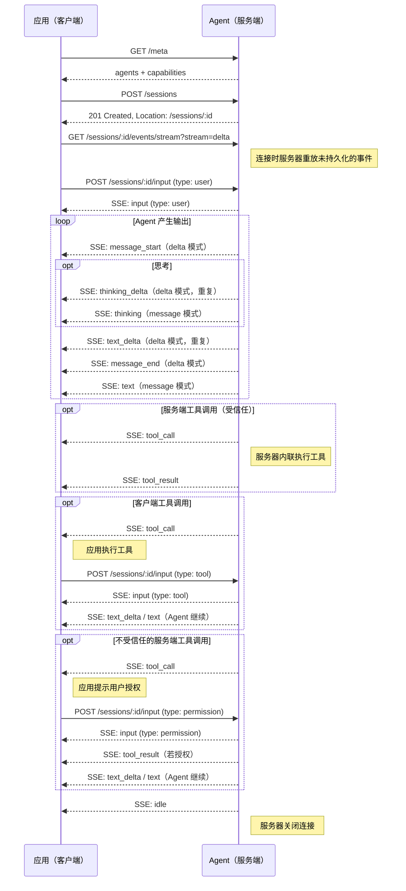

---
head:
  - - meta
    - name: description
      content: Agent Application Protocol (AAP) 轮次请求的响应格式 —— 流式 SSE 增量、批量响应、工具调用和停止原因。
  - - meta
    - property: og:title
      content: 响应 — Agent Application Protocol
  - - meta
    - property: og:description
      content: Agent Application Protocol (AAP) 轮次请求的响应格式 —— 流式 SSE 增量、批量响应、工具调用和停止原因。
  - - meta
    - property: og:url
      content: https://agentapplicationprotocol.com/zh/event
  - - meta
    - name: twitter:title
      content: 响应 — Agent Application Protocol
  - - meta
    - name: twitter:description
      content: Agent Application Protocol (AAP) 轮次请求的响应格式 —— 流式 SSE 增量、批量响应、工具调用和停止原因。
---

# 事件流

所有 Agent 输出均通过会话事件流传递。订阅方式为连接到：

```
GET /sessions/:id/events/stream
```

### 查询参数

- `stream` — _（必填）_ 流模式。必须是 `GET /meta` capabilities 中声明的模式之一。
  - `delta` — 以增量 `text_delta` 和 `thinking_delta` 事件流式传输文本。
  - `message` — 以每条消息完整的 `text` 和 `thinking` 事件流式传输。

若省略 `stream` 或 Agent 不支持所请求的模式，服务器返回 `400 Bad Request`。

服务器返回 `Content-Type: text/event-stream`。多个订阅者可同时连接到同一会话。

连接时，服务器会重放所有尚未持久化到历史记录的事件，使客户端无需游标即可恢复实时会话状态。重放完成后，新的实时事件将在发生时持续流式传输。

## 事件类型

每个 SSE 事件包含 `event` 字段和含 JSON 负载的 `data` 字段。所有事件均携带 `id`（稳定标识符）和 `timestamp`（服务器时间，ISO 8601 格式）。

### `input`

当服务器接受并入队客户端输入时发出。广播给所有订阅者，使每个订阅者无论谁提交都能看到完整的输入历史。

```
event: input
data: {"id":"evt_001","timestamp":"2026-07-12T13:00:00Z","type":"user","content":"What's the weather in Tokyo?"}

event: input
data: {"id":"evt_002","timestamp":"2026-07-12T13:00:01Z","type":"tool","toolCallId":"call_001","content":"Tokyo: 18°C, partly cloudy"}

event: input
data: {"id":"evt_003","timestamp":"2026-07-12T13:00:02Z","type":"permission","toolCallId":"call_002","granted":false,"reason":"User denied."}

event: input
data: {"id":"evt_004","timestamp":"2026-07-12T13:00:03Z","type":"cancel"}
```

### `message_start`

_（仅 delta 模式）_ 在新 Agent 消息开始时发出。携带消息 `id`，使客户端可以将后续所有增量与该消息关联。

```
event: message_start
data: {"id":"msg_abc123"}
```

### `text_delta`

_（仅 delta 模式）_ Agent 的增量文本。

```
event: text_delta
data: {"delta":"I'll prioritize the pricing analysis first."}
```

### `thinking_delta`

_（仅 delta 模式）_ Agent 的增量思考/推理。

```
event: thinking_delta
data: {"delta":"The user wants to reprioritize. I should acknowledge and adjust."}
```

### `message_end`

_（仅 delta 模式）_ 在 Agent 消息完成时发出。携带消息 `id`（用于关联）和消息完成时的服务器 `timestamp`。

```
event: message_end
data: {"id":"msg_abc123","timestamp":"2026-07-12T13:00:05Z"}
```

### `text`

_（仅 message 模式）_ 单条 Agent 消息的完整文本。

```
event: text
data: {"id":"msg_abc123","timestamp":"2026-07-12T13:00:05Z","text":"I'll prioritize the pricing analysis first."}
```

### `thinking`

_（仅 message 模式）_ 单条 Agent 消息的完整思考/推理。

```
event: thinking
data: {"id":"msg_abc124","timestamp":"2026-07-12T13:00:04Z","thinking":"The user wants to reprioritize. I should acknowledge and adjust."}
```

### `tool_call`

当 Agent 请求调用工具时发出。

```
event: tool_call
data: {"id":"evt_005","timestamp":"2026-07-12T13:00:06Z","toolCallId":"call_001","name":"get_weather","input":{"location":"Tokyo"}}
```

对于**客户端工具**，客户端执行工具并通过 [`POST /sessions/:id/input`](/zh/endpoints#post-sessions-id-input) 提交 `type: "tool"` 类型的结果。

对于 `trust: true` 的**服务端工具**，服务器内联调用工具并发出 `tool_result` 事件 —— 无需客户端操作。

对于 `trust: false` 的**服务端工具**，客户端提交 `type: "permission"` 输入以授予或拒绝执行。

### `tool_result`

当服务端工具结果可用时发出。

```
event: tool_result
data: {"id":"evt_006","timestamp":"2026-07-12T13:00:07Z","toolCallId":"call_001","content":"Tokyo: 18°C, partly cloudy"}
```

### `error`

会话级运行时错误时发出。收到错误事件后保持 SSE 连接 —— 服务器会在适当时机关闭连接。

```
event: error
data: {"id":"evt_007","timestamp":"2026-07-12T13:00:08Z","code":"agent_error","message":"Agent failed while processing input."}
```

### `idle`

会话空闲一段时间后发出。服务器在此事件后关闭连接。客户端可随时重新连接。

```
event: idle
data: {"id":"evt_008","timestamp":"2026-07-12T13:00:09Z"}
```

## 时序图


