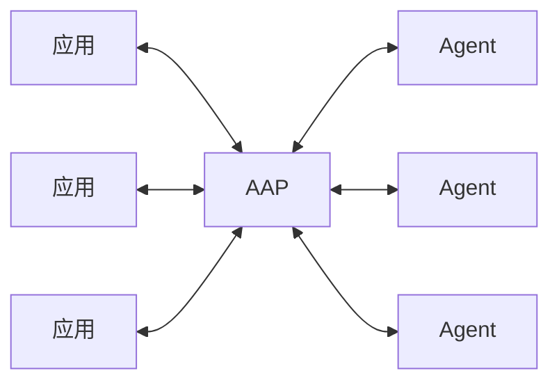
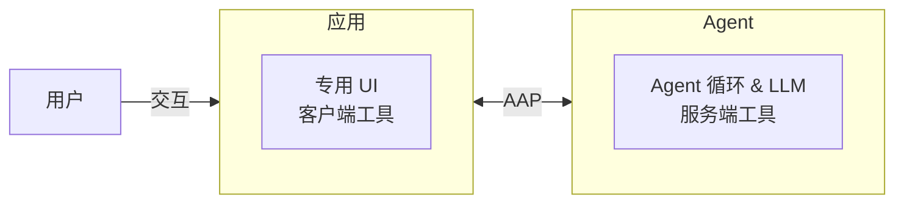

---
head:
  - - meta
    - name: description
      content: Agent Application Protocol (AAP) 概览 —— 架构、核心概念，以及应用与 Agent 如何通过 HTTP 通信。
  - - meta
    - property: og:title
      content: 概览 — Agent Application Protocol
  - - meta
    - property: og:description
      content: Agent Application Protocol (AAP) 概览 —— 架构、核心概念，以及应用与 Agent 如何通过 HTTP 通信。
  - - meta
    - property: og:url
      content: https://agentapplicationprotocol.com/zh/overview
  - - meta
    - name: twitter:title
      content: 概览 — Agent Application Protocol
  - - meta
    - name: twitter:description
      content: Agent Application Protocol (AAP) 概览 —— 架构、核心概念，以及应用与 Agent 如何通过 HTTP 通信。
---

# Agent Application Protocol (∀/A)

连接任意应用与任意 Agent 的协议。

远程优先，Agent 即服务。将 Agent 实现与应用业务逻辑解耦。

## 架构

Agent Application Protocol (AAP) 定义了应用与 Agent 如何通过 HTTP 通信。

- **应用**作为客户端：管理 UI、接受用户输入、提供应用专属工具。
- **Agent**作为服务端：运行 Agent 循环、管理对话历史、提供通用工具、处理 LLM 交互，并执行护栏和安全策略。

AAP 类似 MCP 或 USB —— M 个应用与 N 个 Agent 之间的标准连接协议。任何兼容 AAP 的应用都可以接入任何兼容 AAP 的 Agent。

用户与**应用**交互，而非直接与 Agent 交互。应用管理 UI/UX 并提供领域专属工具；Agent 提供智能能力。

工具分为两类：

- **客户端工具**：由应用拥有并执行。在请求中声明完整 schema。当 LLM 请求时，Agent 发出 `tool_call` 事件并停止；应用执行后携带结果重新提交。
- **服务端工具**：由 Agent 拥有并执行（如持久化内存管理、网络搜索、代码执行）。由服务端在 `GET /meta` 中声明。应用在请求中仅通过名称引用。若 `trust: true`，服务端内联调用工具并流式返回结果，无需停止。

双方均可通过 MCP 服务器扩展能力 —— 应用接入领域工具，Agent 接入通用工具（如网络搜索或代码执行）。

通信使用 HTTP 配合 Server-Sent Events (SSE) 进行流式响应。这使服务端无状态且可水平扩展 —— 会话历史可存储在外部，无需持久化服务端连接。

## 为什么选择 AAP

当前，Agent 与托管它们的应用紧密耦合。AAP 将两者分离 —— 类似微服务解耦后端组件：

- **Agent 构建者**可专注于构建强大的通用 Agent —— 远程、多租户、按用量计费 —— 无需了解应用细节。他们可以使用任意 Agent 框架和语言（如 Vercel AI SDK、LangChain、Strands Agents）。
- **应用构建者**可专注于领域知识和用户体验，接入任意兼容 Agent，无需管理 Agent 循环和上下文窗口。他们可以在原生环境和语言中构建（如 Godot/GDScript、Blender/Python、专业内容创作软件）。
- **双方**均对各自的实现细节保持完全隐私 —— Agent 保密内部逻辑、记忆管理和模型路由；应用保密业务逻辑和用户数据。

这种分离催生了可互相连接的 Agent 与应用市场。

## 示例场景

所有场景都可以连接到同一个通用 Agent —— 应用提供领域专属工具，让 Agent 了解其所处环境。

- **专业创意工具** —— 3D 建模软件、游戏引擎、视频编辑器、CAD 或音频工作站将场景图、资产库或时间线作为工具暴露，让 Agent 能够用自然语言操控几何体、生成关卡或编排复杂编辑。
- **企业平台** —— 任何内部应用连接到共享 Agent，应用侧工具限定在相关领域（HR、法务、财务），无需每个团队自建 Agent。
- **微服务生态** —— Agent 作为智能微服务，被其他服务而非用户调用。任何服务都可以通过 AAP 将推理或决策委托给 Agent，保持 Agent 循环与调用服务解耦。

## 与 ACP 的对比

[Agent Client Protocol (ACP)](https://agentclientprotocol.com) 主要为 IDE 连接本地编码 Agent 而设计。AAP 面向任意应用连接任意远程 Agent。

|      | AAP                          | ACP                      |
| ---- | ---------------------------- | ------------------------ |
| 目标 | 任意应用 ↔ 任意 Agent        | IDE ↔ 编码 Agent         |
| 传输 | HTTP + SSE，无双向通信       | JSON-RPC，需要长连接会话 |
| 工具 | 应用侧工具 + Agent 工具      | 仅 Agent 工具            |
| 部署 | 远程优先，SaaS，Agent 即服务 | 本地优先                 |

> [ACP 的流式 HTTP 传输层](https://agentclientprotocol.com/protocol/transports#streamable-http) 仍处于草案阶段。
>
> [ACP 的应用侧工具](https://agentclientprotocol.com/rfds/mcp-over-acp) 也仍处于草案阶段。

## 致谢

此协议灵感来源于 [Agent Client Protocol (ACP)](https://agentclientprotocol.com)、[Model Context Protocol (MCP)](https://modelcontextprotocol.io) 以及 Claude Agent SDK。
