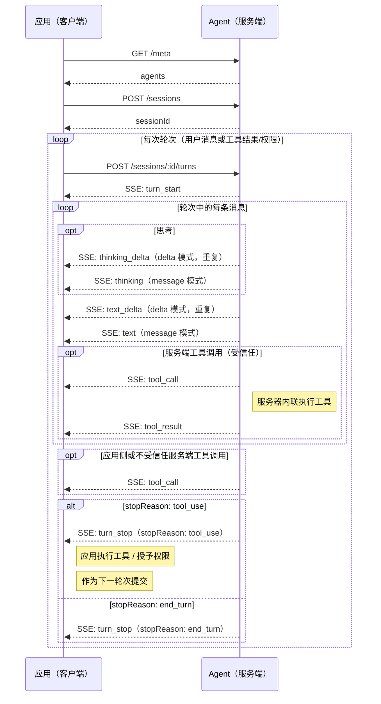

---
head:
  - - meta
    - name: description
      content: Agent Application Protocol (AAP) 轮次请求的响应格式 —— 流式 SSE 增量、批量响应、工具调用和停止原因。
  - - meta
    - property: og:title
      content: 响应 — Agent Application Protocol
  - - meta
    - property: og:description
      content: Agent Application Protocol (AAP) 轮次请求的响应格式 —— 流式 SSE 增量、批量响应、工具调用和停止原因。
  - - meta
    - property: og:url
      content: https://agentapplicationprotocol.com/zh/response
  - - meta
    - name: twitter:title
      content: 响应 — Agent Application Protocol
  - - meta
    - name: twitter:description
      content: Agent Application Protocol (AAP) 轮次请求的响应格式 —— 流式 SSE 增量、批量响应、工具调用和停止原因。
---

# 响应

本页描述轮次请求 [`POST /sessions/{id}/turns`](./endpoints.md) 的响应格式。

## 响应模式

### `stream: "delta"`

`Content-Type: text/event-stream`。服务器在产生时流式传输 SSE 事件。文本以增量 `text_delta` 事件发送；思考以增量 `thinking_delta` 事件发送。Agent 通常启用流式传输调用 LLM 以实时产生增量。

### `stream: "message"`

`Content-Type: text/event-stream`。服务器流式传输 SSE 事件，但文本以每条消息一个完整的 `text`/`thinking` 事件发送，而非增量。单次轮次可能产生多条消息，每条作为独立事件发出。工具调用事件仍在发生时到达。Agent 可以禁用流式传输调用 LLM，并在完成后一次性发出每条完整消息。

### `stream: "none"`（默认）

`Content-Type: application/json`。Agent 完成后服务器返回单个 JSON 响应。

## SSE 事件（`stream: "delta"` 和 `stream: "message"`）

每个事件是 `data:` 字段上的 JSON 对象。

### `turn_start`

标记 Agent 响应的开始。这是每个 `POST /sessions/:id/turns` 流中的第一个事件。

```
event: turn_start
data: {}
```

### `text_delta`

_（仅 delta 模式）_ Agent 文本响应的增量。仅在 `turn_start` 和 `turn_stop` 之间发出。

```
event: text_delta
data: {"delta": "东京的天气是..."}
```

### `thinking_delta`

_（仅 delta 模式）_ Agent 思考/推理的增量。仅在 `turn_start` 和 `turn_stop` 之间发出。

```
event: thinking_delta
data: {"delta": "用户在询问东京天气，我应该..."}
```

### `text`

_（仅 message 模式）_ 单条 Agent 消息的完整文本。一次轮次可能产生多条消息，每条作为独立的 `text` 事件发出。仅在 `turn_start` 和 `turn_stop` 之间发出。

```
event: text
data: {"text": "东京天气 18°C，多云。"}
```

### `thinking`

_（仅 message 模式）_ 单条 Agent 消息的完整思考/推理。一次轮次可能产生多条消息，每条作为独立的 `thinking` 事件发出。仅在 `turn_start` 和 `turn_stop` 之间发出。

```
event: thinking
data: {"thinking": "用户在询问东京天气，我应该使用天气工具。"}
```

### `tool_call`

仅在 `turn_start` 和 `turn_stop` 之间发出。Agent 想要调用工具。`turn_stop` 前可能发出多个 `tool_call` 事件 —— 客户端应收集所有事件并并行处理。

```
event: tool_call
data: {"toolCallId": "call_001", "name": "get_weather", "input": {"location": "Tokyo"}}
```

对于**客户端工具**，客户端执行工具并在后续 `POST /sessions/:id/turns` 请求中提交结果。

对于 `trust: true` 的**服务端工具**，服务器内联调用工具并发出带结果的 `tool_result` 事件 —— 无需客户端往返。Agent 继续流式传输而不停止。

对于 `trust: false` 的**服务端工具**，服务器停止，客户端在后续 `POST /sessions/:id/turns` 请求中为每个不受信任的工具调用提交权限决定。Agent 无论如何都会继续 —— 若被拒绝，LLM 会被告知工具未被允许。

只有当至少有一个客户端工具调用或一个需要客户端操作的不受信任服务端工具调用时，Agent 才会以 `stopReason: "tool_use"` 发出 `turn_stop`。若所有工具调用都是受信任的服务端工具，Agent 内联处理它们并继续而不停止。

客户端必须收集所有客户端工具结果和不受信任服务端工具权限，并在单个后续 `POST /sessions/:id/turns` 请求中一起提交。

工具名称在单个请求中的应用工具和 Agent 工具之间必须唯一。客户端通过将名称与请求中声明的工具匹配来识别工具调用是应用侧还是服务端。

### `tool_result`

_（仅服务端工具）_ 仅在 `turn_start` 和 `turn_stop` 之间发出。服务器执行服务端工具后发出 —— 受信任工具内联执行，或客户端为不受信任工具授权后执行。Agent 在此事件后继续流式传输。

```
event: tool_result
data: {"toolCallId": "call_001", "content": "东京：18°C，多云"}
```

### `turn_stop`

始终是流中的最后一个事件。标记 Agent 响应的结束。

```
event: turn_stop
data: {"stopReason": "end_turn"}
```

**停止原因：**

| `stopReason` | 含义                                                                                                        |
| ------------ | ----------------------------------------------------------------------------------------------------------- |
| `end_turn`   | Agent 正常完成                                                                                              |
| `tool_use`   | Agent 发出了一个或多个需要客户端操作的 `tool_call` 事件（客户端工具或不受信任的服务端工具）                 |
| `max_tokens` | 达到 token 限制 —— Agent 应实现自己的历史压缩策略以避免此情况；若没有压缩且上下文窗口溢出，则返回此停止原因 |
| `refusal`    | LLM 拒绝响应（如安全策略）                                                                                  |
| `error`      | 服务器在流式传输过程中遇到错误                                                                              |

### 时序图



## JSON 响应（`stream: "none"`）

```typescript
/** 非流式（`stream: "none"`）请求的 JSON 响应体。 */
interface AgentResponse {
  stopReason: StopReason;
  messages: HistoryMessage[];
}
```

### 系统消息

```json
{
  "role": "system",
  "content": "你是一个简洁回答的有帮助助手。"
}
```

### 用户消息

```json
{ "role": "user", "content": "东京天气怎么样？" }
```

`content` 可以是字符串或内容块数组。

### 助手消息

```json
{
  "role": "assistant",
  "content": [
    {
      "type": "thinking",
      "thinking": "用户想知道东京天气。我应该使用 get_weather 工具。"
    },
    { "type": "text", "text": "让我为你查一下。" },
    {
      "type": "tool_use",
      "toolCallId": "call_001",
      "name": "get_weather",
      "input": { "location": "Tokyo" }
    }
  ]
}
```

### 工具结果消息

- **服务端工具**：Agent 执行工具，将结果存储在历史中，并包含在返回的消息中。
- **客户端工具**：客户端执行工具并通过 `POST /sessions/:id/turns` 提交结果。

```json
{
  "role": "tool",
  "toolCallId": "call_001",
  "content": "东京：18°C，多云"
}
```

`content` 可以是字符串或内容块数组。

### 工具权限消息

用于通过 `POST /sessions/:id/turns` 为不受信任的服务端工具调用提交权限决定。Agent 继续并告知 LLM 决定。这些消息永远不会存储在会话历史中。

当 `granted: true` 时，Agent 执行工具并将工具结果存储在历史中。当 `granted: false` 时，Agent 在历史中存储带拒绝描述的 `tool` 消息（如 `"工具调用被拒绝"`，或若提供了 `reason` 则为 `"工具调用被拒绝：<reason>"`）以告知 LLM。客户端可以包含可选的 `reason` 字符串，Agent 会将其转达给 LLM。

```json
{ "role": "tool_permission", "toolCallId": "call_002", "granted": true }
```

```json
{
  "role": "tool_permission",
  "toolCallId": "call_002",
  "granted": false,
  "reason": "用户拒绝"
}
```

## 示例

### SSE 事件示例

正常响应（`stream: "delta"`）：

```
event: turn_start
data: {}

event: text_delta
data: {"delta": "东京的天气是 "}

event: text_delta
data: {"delta": "18°C，多云。"}

event: turn_stop
data: {"stopReason": "end_turn"}
```

带客户端工具调用（`stream: "message"`）：

```
event: turn_start
data: {}

event: tool_call
data: {"toolCallId": "call_001", "name": "get_weather", "input": {"location": "Tokyo"}}

event: turn_stop
data: {"stopReason": "tool_use"}
```

客户端执行工具并在下一轮次提交结果。Agent 恢复：

```
event: turn_start
data: {}

event: text
data: {"text": "东京天气 18°C，多云。"}

event: turn_stop
data: {"stopReason": "end_turn"}
```

带受信任服务端工具调用（内联，无客户端往返）：

```
event: turn_start
data: {}

event: tool_call
data: {"toolCallId": "call_002", "name": "web_search", "input": {"query": "Tokyo weather today"}}

event: tool_result
data: {"toolCallId": "call_002", "content": "东京：18°C，多云"}

event: text_delta
data: {"delta": "东京天气 18°C，多云。"}

event: turn_stop
data: {"stopReason": "end_turn"}
```

### JSON 响应示例

正常响应：

```json
{
  "stopReason": "end_turn",
  "messages": [
    {
      "role": "assistant",
      "content": "东京天气 18°C，多云。"
    }
  ]
}
```

带思考：

```json
{
  "stopReason": "end_turn",
  "messages": [
    {
      "role": "assistant",
      "content": [
        {
          "type": "thinking",
          "thinking": "用户想知道东京天气。我应该使用 get_weather 工具。"
        },
        {
          "type": "text",
          "text": "东京天气 18°C，多云。"
        }
      ]
    }
  ]
}
```

需要客户端工具或不受信任服务端工具需要权限时：

```json
{
  "stopReason": "tool_use",
  "messages": [
    {
      "role": "assistant",
      "content": [
        {
          "type": "tool_use",
          "toolCallId": "call_001",
          "name": "get_weather",
          "input": { "location": "Tokyo" }
        }
      ]
    }
  ]
}
```

受信任服务端工具内联调用时，完整交换包含在返回的消息中：

```json
{
  "stopReason": "end_turn",
  "messages": [
    {
      "role": "assistant",
      "content": [
        {
          "type": "tool_use",
          "toolCallId": "call_002",
          "name": "web_search",
          "input": { "query": "Tokyo weather today" }
        }
      ]
    },
    {
      "role": "tool",
      "toolCallId": "call_002",
      "content": "东京：18°C，多云"
    },
    {
      "role": "assistant",
      "content": "东京天气 18°C，多云。"
    }
  ]
}
```

不受信任服务端工具被授权并执行后，后续轮次响应包含工具结果和 Agent 最终回复：

```json
{
  "stopReason": "end_turn",
  "messages": [
    {
      "role": "tool",
      "toolCallId": "call_003",
      "content": "东京：18°C，多云"
    },
    {
      "role": "assistant",
      "content": "东京天气 18°C，多云。"
    }
  ]
}
```
