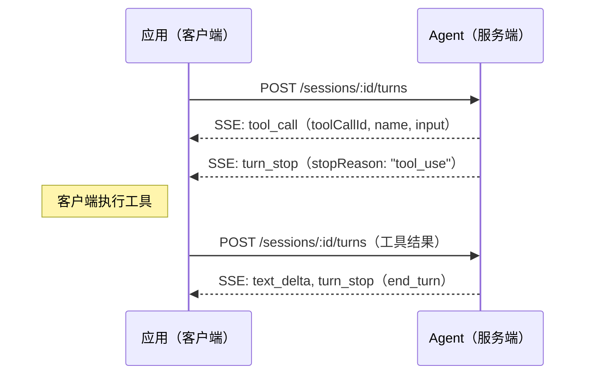
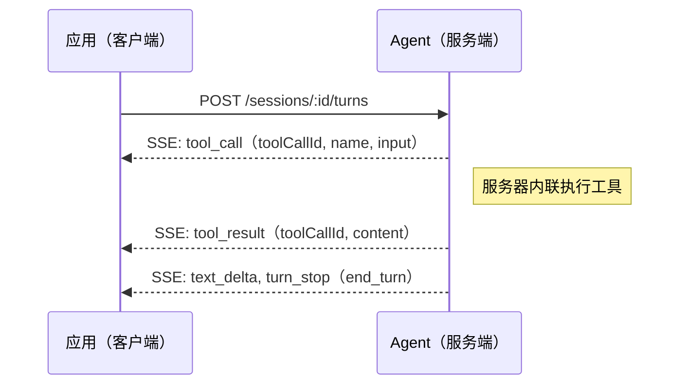
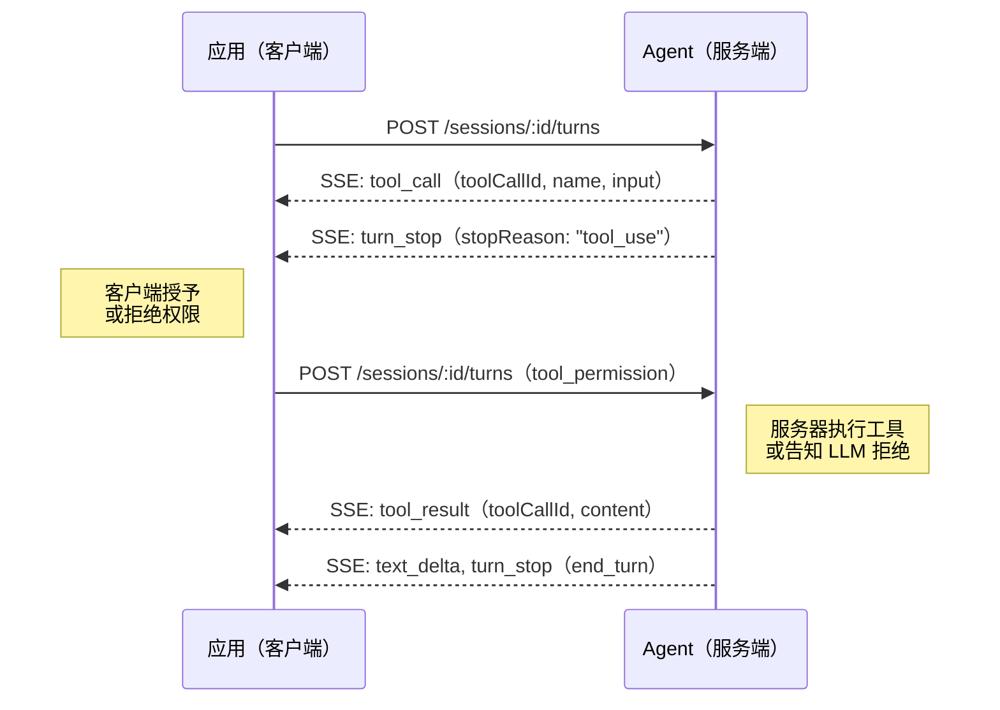
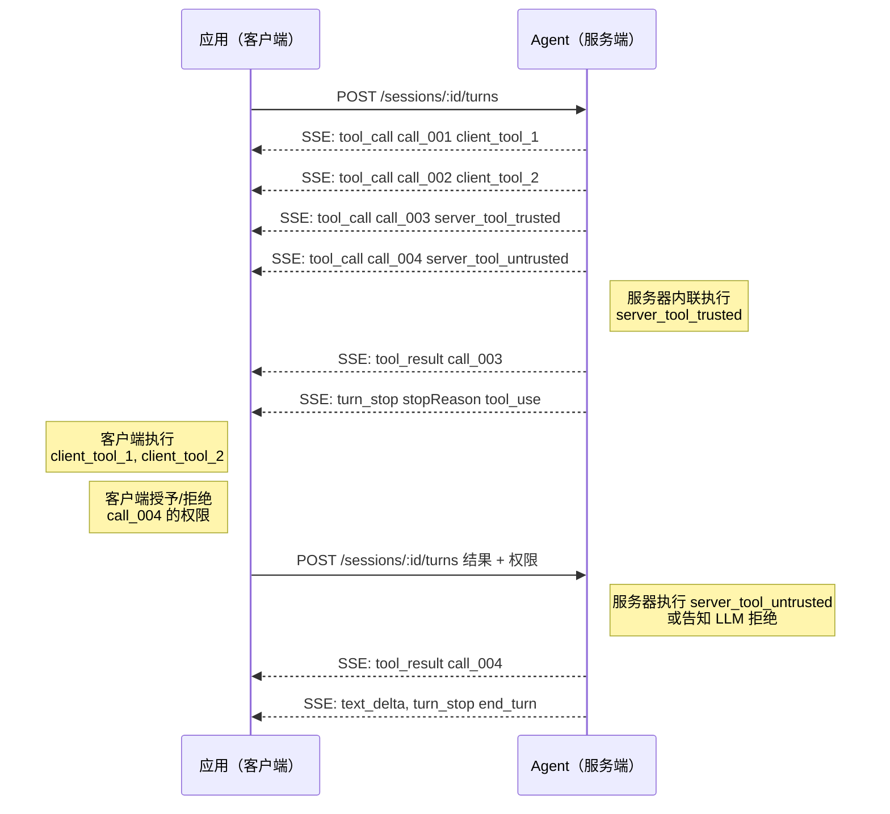

---
head:
  - - meta
    - name: description
      content: Agent Application Protocol (AAP) 工具调用处理 —— 客户端和服务端工具流程、权限和工具调用恢复。
  - - meta
    - property: og:title
      content: 工具调用 — Agent Application Protocol
  - - meta
    - property: og:description
      content: Agent Application Protocol (AAP) 工具调用处理 —— 客户端和服务端工具流程、权限和工具调用恢复。
  - - meta
    - property: og:url
      content: https://agentapplicationprotocol.com/zh/tool-call
  - - meta
    - name: twitter:title
      content: 工具调用 — Agent Application Protocol
  - - meta
    - name: twitter:description
      content: Agent Application Protocol (AAP) 工具调用处理 —— 客户端和服务端工具流程、权限和工具调用恢复。
---

# 工具调用

## 工具调用流程

### 客户端工具

### 服务端工具（受信任，内联）

### 服务端工具（需要权限）

## 未暴露的服务端工具

服务器可能有未在 `GET /meta` 中声明的内部工具。服务器仍可以为这些工具流式传输 `tool_call` 和 `tool_result` 事件，让客户端可以观察它们。客户端应准备好处理未知工具名称 —— 显示或丢弃它们。

## 并行工具调用

服务器可能在 `turn_stop` 前发出多个 `tool_call` 事件。客户端应处理所有事件 —— 执行客户端工具并响应不受信任服务端工具权限 —— 然后在单个 `POST /sessions/:id/turns` 中一起重新提交所有结果和权限。受信任的服务端工具由服务器内联处理，不需要客户端操作。

示例：两个客户端工具、一个受信任服务端工具和一个不受信任服务端工具 —— 全部并行调用：

## 工具调用解析

### 服务端

LLM 发出工具调用后，服务器解析每个调用：

1. 对每个 `tool_call`，检查是否为受信任的服务端工具 —— 若是，立即内联执行并发出 `tool_result` 事件。
2. 若仍有未执行的工具调用，以 `stopReason: "tool_use"` 发出 `turn_stop`。
3. 客户端重新提交时，将客户端提供的工具结果消息追加到历史。
4. 对提交中的每个 `tool_permission`，通过 `toolCallId` 找到匹配的 `tool_call` —— 若授权则执行工具，或存储带拒绝描述的 `tool` 消息（如 `"工具调用被拒绝"`，或若提供了 `reason` 则为 `"工具调用被拒绝：<reason>"`）以告知 LLM。`tool_permission` 消息永远不会追加到历史 —— 处理后丢弃。
5. 将所有 `tool_result` 事件追加到历史并继续 Agent 循环。

### 客户端

当客户端收到 `stopReason: "tool_use"` 的 `turn_stop` 时：

1. 收集当前轮次的所有 `tool_call` 事件。
2. 忽略已有匹配 `tool_result` 的 `toolCallId` —— 这些已由服务器内联处理。
3. 对每个剩余的工具调用，通过将名称与请求中声明的工具匹配来判断是客户端工具还是服务端工具：
   - 客户端工具：可选地提示用户是否继续，然后执行并收集结果。
   - 服务端工具：提示用户或应用策略来授予或拒绝权限。
4. 在单个 `POST /sessions/:id/turns` 中一起提交所有结果和权限。

## 工具调用恢复

若客户端没有存储会话历史（如重启或恢复后），可以调用 `GET /sessions/:id/history` 获取会话历史并从中断处恢复：

1. 通过 `GET /sessions/:id/history` 获取会话历史。
2. 检查历史中最后一条助手消息 —— 若有未解析的工具调用（历史中没有匹配的 `tool` 消息），则最后一次轮次以 `stopReason: "tool_use"` 结束，需要客户端操作。
3. 应用相同的客户端解析逻辑：识别要执行的客户端工具和需要权限的服务端工具。
4. 通过 `POST /sessions/:id/turns` 提交结果和权限以继续。
