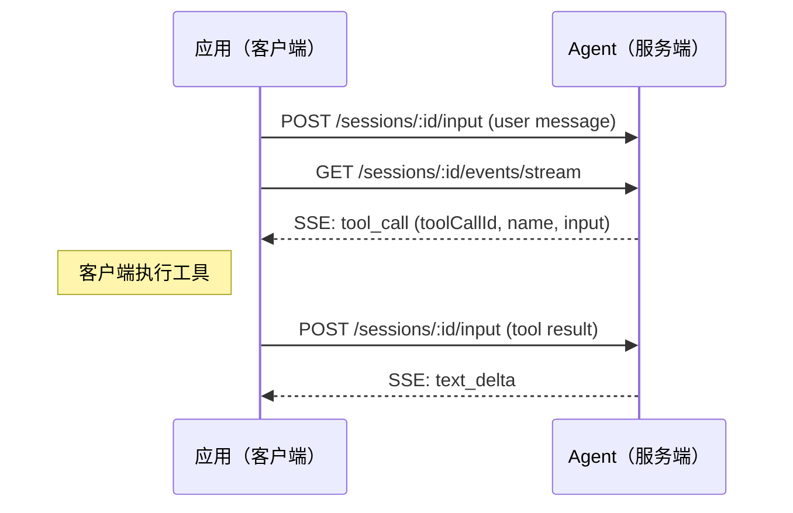
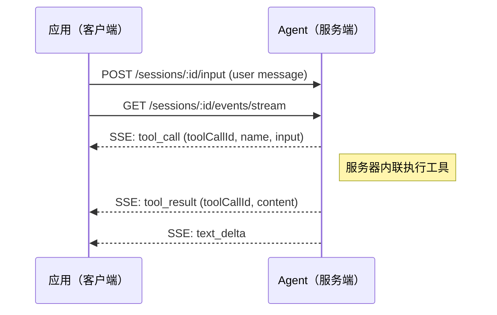
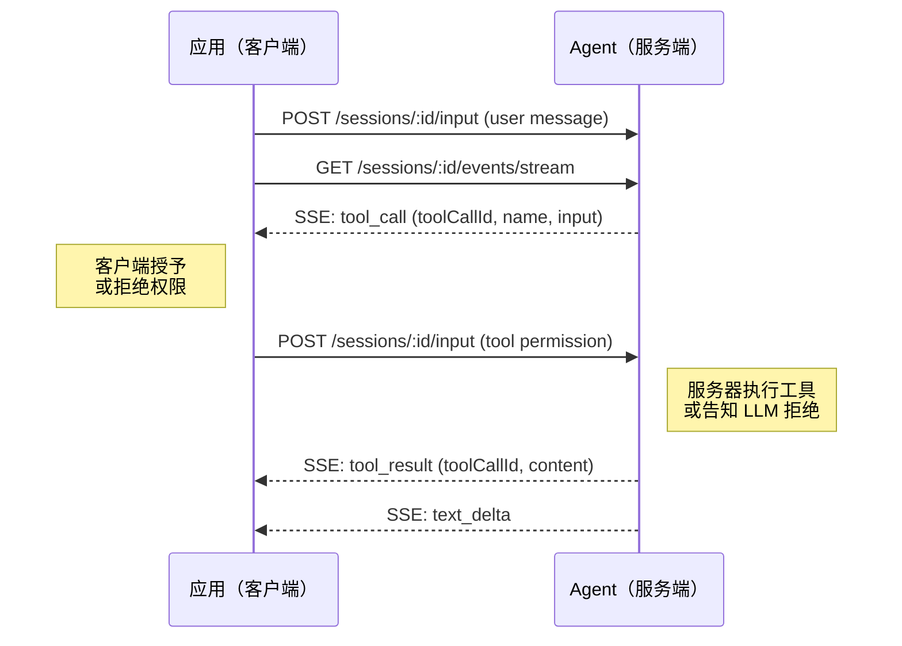
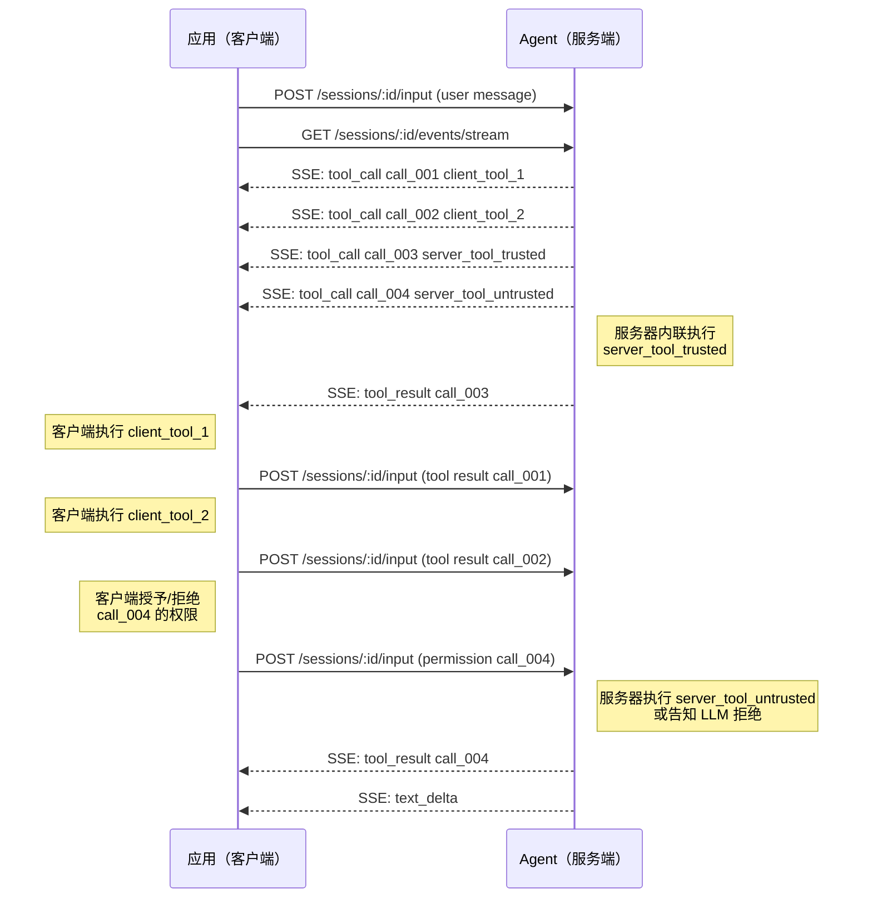

---
head:
  - - meta
    - name: description
      content: Agent Application Protocol (AAP) 工具调用处理 —— 客户端和服务端工具流程、权限和工具调用恢复。
  - - meta
    - property: og:title
      content: 工具调用 — Agent Application Protocol
  - - meta
    - property: og:description
      content: Agent Application Protocol (AAP) 工具调用处理 —— 客户端和服务端工具流程、权限和工具调用恢复。
  - - meta
    - property: og:url
      content: https://agentapplicationprotocol.com/zh/tool-call
  - - meta
    - name: twitter:title
      content: 工具调用 — Agent Application Protocol
  - - meta
    - name: twitter:description
      content: Agent Application Protocol (AAP) 工具调用处理 —— 客户端和服务端工具流程、权限和工具调用恢复。
---

# 工具调用

## 工具调用流程

### 客户端工具

```mermaid
sequenceDiagram
    participant App as 应用（客户端）
    participant Agent as Agent（服务端）

    App->>Agent: POST /sessions/:id/input (user message)
    App->>Agent: GET /sessions/:id/events/stream
    Agent-->>App: SSE: tool_call (toolCallId, name, input)
    Note left of App: 客户端执行工具
    App->>Agent: POST /sessions/:id/input (tool result)
    Agent-->>App: SSE: text_delta
```

### 服务端工具（受信任，内联）

```mermaid
sequenceDiagram
    participant App as 应用（客户端）
    participant Agent as Agent（服务端）

    App->>Agent: POST /sessions/:id/input (user message)
    App->>Agent: GET /sessions/:id/events/stream
    Agent-->>App: SSE: tool_call (toolCallId, name, input)
    Note right of Agent: 服务器内联执行工具
    Agent-->>App: SSE: tool_result (toolCallId, content)
    Agent-->>App: SSE: text_delta
```

### 服务端工具（需要权限）

```mermaid
sequenceDiagram
    participant App as 应用（客户端）
    participant Agent as Agent（服务端）

    App->>Agent: POST /sessions/:id/input (user message)
    App->>Agent: GET /sessions/:id/events/stream
    Agent-->>App: SSE: tool_call (toolCallId, name, input)
    Note left of App: 客户端授予<br/>或拒绝权限
    App->>Agent: POST /sessions/:id/input (tool permission)
    Note right of Agent: 服务器执行工具<br/>或告知 LLM 拒绝
    Agent-->>App: SSE: tool_result (toolCallId, content)
    Agent-->>App: SSE: text_delta
```

## 未暴露的服务端工具

服务器可能有未在 [`GET /meta`](/zh/endpoints#get-meta) 中声明的内部工具。服务器仍可以为这些工具流式传输 `tool_call` 和 `tool_result` 事件，使客户端能够观察它们。客户端应准备好处理未知工具名称 —— 显示或丢弃它们。

## 并行工具调用

服务器可能连续发出多个 `tool_call` 事件。每个结果或权限通过 `POST /sessions/:id/input` 单独提交。客户端无需批量提交。受信任的服务端工具由服务器内联处理，不需要客户端操作。

示例：两个客户端工具、一个受信任服务端工具和一个不受信任服务端工具 —— 全部并行调用：

```mermaid
sequenceDiagram
    participant App as 应用（客户端）
    participant Agent as Agent（服务端）

    App->>Agent: POST /sessions/:id/input (user message)
    App->>Agent: GET /sessions/:id/events/stream
    Agent-->>App: SSE: tool_call call_001 client_tool_1
    Agent-->>App: SSE: tool_call call_002 client_tool_2
    Agent-->>App: SSE: tool_call call_003 server_tool_trusted
    Agent-->>App: SSE: tool_call call_004 server_tool_untrusted
    Note right of Agent: 服务器内联执行<br/>server_tool_trusted
    Agent-->>App: SSE: tool_result call_003
    Note left of App: 客户端执行 client_tool_1
    App->>Agent: POST /sessions/:id/input (tool result call_001)
    Note left of App: 客户端执行 client_tool_2
    App->>Agent: POST /sessions/:id/input (tool result call_002)
    Note left of App: 客户端授予/拒绝<br/>call_004 的权限
    App->>Agent: POST /sessions/:id/input (permission call_004)
    Note right of Agent: 服务器执行 server_tool_untrusted<br/>或告知 LLM 拒绝
    Agent-->>App: SSE: tool_result call_004
    Agent-->>App: SSE: text_delta
```

## 工具调用解析

### 服务端

LLM 发出工具调用后，服务器解析每个调用：

1. 对每个 `tool_call`，检查是否为受信任的服务端工具 —— 若是，立即内联执行并发出 `tool_result` 事件。
2. 将所有剩余未解析的工具调用持久化为 `pending`。
3. 当客户端通过 `POST /sessions/:id/input` 提交结果或权限时，验证 `toolCallId` —— 对未知或已解析的 ID 返回 `400 Bad Request`。
4. 将客户端提供的工具结果消息追加到历史。
5. 对每个 `tool_permission`，通过 `toolCallId` 找到匹配的 `tool_call` —— 若授权则执行工具，或存储带拒绝描述的 `tool` 消息（如 `"Tool call denied"`，或若提供了 `reason` 则为 `"Tool call denied: <reason>"`）以告知 LLM。`tool_permission` 输入为控制输入，不追加到模型可见历史。
6. 将所有 `tool_result` 事件追加到历史并继续 Agent 循环。

### 客户端

当客户端收到 `tool_call` 事件时，通过将工具名称与创建或更新会话时声明的客户端工具进行匹配来决定是否采取行动：

- **客户端工具** —— 执行工具并通过 [`POST /sessions/:id/input`](/zh/endpoints#post-sessions-id-input) 提交 `type: "tool"` 类型的结果。
- **`trust: false` 的服务端工具** —— 提示用户或应用策略，然后提交 `type: "permission"` 输入以授予或拒绝执行。
- **`trust: true` 的服务端工具** —— 服务器内联执行并发出 `tool_result` 事件，无需客户端操作。
- **未知工具** —— 优雅处理，显示或丢弃。未知工具调用是 Agent 选择不暴露的服务器内部工具。

每个结果或权限单独提交。客户端无需等待所有工具调用完成后再提交。

## 多订阅者

多个客户端可以同时连接到同一会话事件流。所有订阅者接收相同的事件 —— 包括 `tool_call` 事件。这意味着多个客户端可能同时为同一工具调用显示 UI。

客户端必须妥善处理这种情况：

- 当客户端收到 `tool_call` 事件时，显示相应的 UI（执行工具或提示用户授权）。
- 当客户端收到 `input` 事件，其 `type` 为 `"tool"` 或 `"permission"`，且 `toolCallId` 对应当前 UI 中待处理的工具调用时，说明另一订阅者已处理该调用 —— 应立即关闭该工具调用的 UI。
- 不要为已解析的工具调用再次提交结果或权限。服务器将以 `400 Bad Request` 拒绝该请求。

## 工具调用恢复

若客户端没有内存状态（如重启或重新连接后），可调用 [`GET /sessions/:id`](/zh/endpoints#get-sessions-id) 获取 `pending` 并恢复：

1. 通过 [`GET /sessions/:id`](/zh/endpoints#get-sessions-id) 获取会话。
2. 若 `pending` 非空，则有工具调用等待客户端操作。
3. 对每个待处理的工具调用，将工具名称与已声明的客户端工具匹配，判断应提交 `tool` 结果还是 `permission`。
4. 通过 [`POST /sessions/:id/input`](/zh/endpoints#post-sessions-id-input) 单独提交每个结果或权限。

客户端仍可调用 [`GET /sessions/:id/history`](/zh/endpoints#get-sessions-id-history) 用于展示、审计或兜底恢复。
